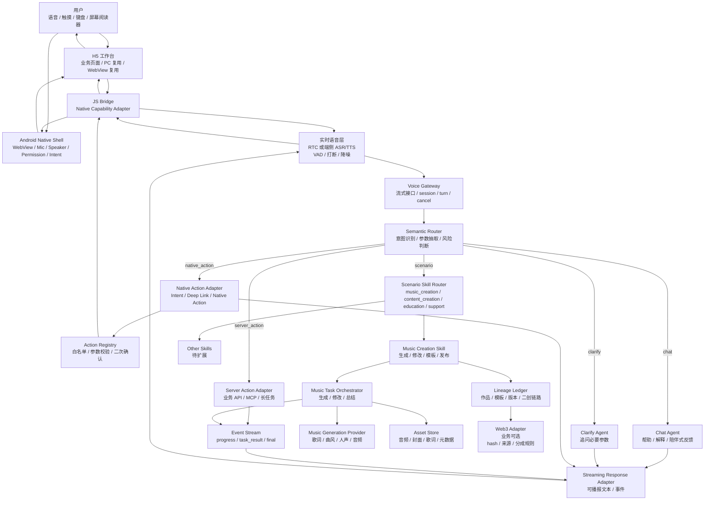

# Voice Engine 技术架构

## 1. 架构结论

Voice Engine 采用 H5-first + Android Native Shell 架构：

```text
H5 工作台 / PC Web / Android WebView
  -> Android Native Bridge（语音、权限、Intent、分享、文件选择）
  -> Voice Gateway
  -> Semantic Router
  -> Chat / Native Action / Server Action / Scenario Skill / Business Event
  -> 流式语音反馈
```

这里的 `Intent` 分两层：

- 语义意图：模型判断用户想聊天、创作、修改、发布还是打开页面。
- Android Intent：Android Native Shell 执行系统或 App 内动作，例如分享、选择文件、打开系统设置、唤起外部页面。

这里的产品页面优先用 H5 实现，同一套业务页面可以被 Android WebView 和 PC Web 复用。Android 原生层只做 H5 做不好的能力：麦克风权限、后台播放/录音、Intent、系统分享、文件选择、TTS/ASR 能力桥接、TalkBack 适配增强。

ECHORURA 音乐创作是第一个 Scenario Skill，不进入 Voice Engine 核心。后续可以接入内容创作、教育、客服、设备操作等场景。

默认不使用云手机。云手机只适合“远程代执行”或“无用户设备在线”的兜底场景，不是 ECHORURA 的主路径。

## 2. 总体架构



## 3. 核心模块

### 3.1 H5 工作台

职责：

- 承载核心业务页面，例如创作页、试听页、作品页、模板页、发布确认页。
- 同一套页面在 Android WebView 和 PC Web 复用。
- 展示语音状态、任务进度、草稿结果、模板来源和发布状态。
- 与 JS Bridge 通信，请求语音、文件选择、分享、系统设置等 Native 能力。
- 支持键盘导航、ARIA 标签、大字号和屏幕阅读器友好结构。

### 3.2 Android Native Shell

职责：

- 承载 WebView。
- 管理麦克风、音频播放、文件选择、系统分享、通知和权限。
- 通过 JS Bridge 暴露白名单 Native 能力。
- 执行 Android Intent、Deep Link、App 内 Native Action。
- 增强 TalkBack、系统 TTS/ASR、震动反馈等无障碍体验。
- 把 Native 动作结果回传给 H5 和后端。

### 3.3 JS Bridge / Native Capability Adapter

职责：

- 定义 H5 与 Android Shell 的双向调用协议。
- H5 调用 Native：`startVoiceInput`、`stopVoiceInput`、`speak`、`shareWork`、`pickAudioFile`、`openSettings`。
- Native 回调 H5：`voicePartial`、`voiceFinal`、`nativeActionResult`、`permissionResult`。
- 所有 Native action 必须白名单化，高风险动作必须二次确认。

### 3.4 实时语音层

职责：

- S2S 对话入口：用户说话后直接获得语音回复，先验证自然对话体验。
- VAD / 打断：用户插话时停止当前播报或取消当前 turn，作为第二阶段重点。
- ASR / 文本旁路：在需要意图识别时，把用户语音同步转成文本或结构化事件。
- TTS / 语音输出：非 S2S 链路或业务播报需要时，把模型回复转语音。
- 音频 3A：降噪、回声消除、自动增益等基础音频处理。
- S2S：第一阶段优先参考豆包端到端实时语音模型，跑通“能对话”的语音入口。
- RTC / ASR / TTS 级联：作为补充方案，用于需要更强文本控制、CustomLLM 或业务链路调试的场景。

边界：

- S2S 阶段先不追求业务动作执行，只验证语音输入、语音输出、延迟、稳定性和基础上下文。
- VAD / 打断阶段先处理体验事件，例如 `voice_interrupted`、`turn_cancelled`。
- 意图识别、二次确认、业务路由和执行权限放到第三阶段，由 Voice Gateway / Semantic Router 控制。

### 3.5 Voice Gateway

职责：

- 统一接收语音转写文本。
- 承接 S2S 会话旁路出来的文本、转写结果或对话状态。
- 后续也可以承接火山 RTC 对话式 AI 的 CustomLLM 回调，或承接 H5 / Native Shell 直接上传的转写文本。
- 管理 `session_id`、`turn_id`、上下文、取消状态。
- 对外提供 OpenAI 兼容流式接口或 App 专用 WebSocket/SSE。
- 把 Router、任务进度和最终结果转成端侧可播放事件。
- 返回两类输出：给实时语音层播报的 `speakable_text`，以及给 H5 / Native / 后端消费的结构化 `events`。

### 3.6 Semantic Router

职责：

- 判断 `chat`、`native_action`、`server_action`、`scenario`、`clarify`、`reject`。
- 对业务场景继续判断 `scenario_id` 和 `scenario_intent`，例如 `music_creation.create_song`。
- 抽取参数，例如风格、主题、情绪、语种、人声、时长、模板 ID。
- 判断是否需要二次确认。
- 低置信度时走澄清，不默认执行。

### 3.7 Music Task Orchestrator

职责：

- 把创作意图拆成音乐生成任务。
- 调用音乐生成 Provider。
- 维护草稿、版本和修改历史。
- 把长任务进度流式返回。
- 输出口语化总结，方便 TTS 播报。

### 3.8 Native Action Adapter

职责：

- 把语义动作映射到端侧 native action。
- 支持 Android Intent、Deep Link、App 内 Native Action。
- 执行前做白名单和参数校验。
- 高风险动作要求二次确认。

示例：

| 语义动作 | Android 执行 |
|---|---|
| 打开作品页 | H5 route / Deep Link |
| 分享作品链接 | `ACTION_SEND` |
| 打开浏览器查看作品页 | `ACTION_VIEW` |
| 选择本地音频参考 | Activity Result API |
| 打开系统设置授权麦克风 | Settings Intent |

### 3.9 Scenario Skill Router

职责：

- 把业务类意图分发给具体场景能力。
- 第一阶段接入 `music_creation`。
- 后续可接入 `content_creation`、`education`、`support`、`device_control` 等场景。
- 场景模块只依赖 Voice Engine 的通用协议，不反向污染核心层。

### 3.10 Music Creation Skill

职责：

- 封装 ECHORURA 音乐创作业务能力。
- 处理 `create_song`、`revise_song`、`choose_template`、`publish_work`。
- 调用 Music Task Orchestrator、Template Service、Publish Service、Lineage Ledger。

### 3.11 Lineage Ledger 与 Web3 Adapter

职责：

- 记录作品 ID、模板 ID、版本 ID、来源关系。
- 记录用户选择的模板继承链。
- 生成可上链或可哈希的轻量事件。
- 第一阶段只做后台记录，不把钱包和链操作暴露给普通用户。

## 4. 主流程

### 4.1 创建音乐

```text
用户：“帮我做一首下班路上听的中文 LoFi。”
-> ASR 文本
-> Router: create_song
-> Orchestrator: 创建音乐任务
-> Music Provider: 生成歌词/曲风/音频
-> Asset Store: 保存草稿
-> Response: “已生成第一版，要不要听一下？”
```

### 4.2 语音修改

```text
用户：“副歌更温暖一点，节奏慢一点。”
-> Router: revise_song
-> Orchestrator: 基于当前草稿创建新版本
-> Music Provider: 重新生成或局部修改
-> Lineage Ledger: version_1 -> version_2
-> Response: “已生成更温暖的版本。”
```

### 4.3 模板复用

```text
用户：“用城市夜跑模板。”
-> Router: choose_template
-> Template Service: 绑定 template_id
-> Orchestrator: 用模板参数生成作品
-> Lineage Ledger: template_id -> work_id
```

### 4.4 发布

```text
用户：“保存并发布。”
-> Router: publish_work
-> Gateway: 二次确认
-> Publish Service: 生成作品页
-> Lineage Ledger: 记录发布事件
-> Web3 Adapter: 记录 hash / 来源 / 默认分成规则
```

## 5. 关键边界

- Android Intent 不是 UI 自动化，不能替代第三方 App 内部操作。
- H5 是业务主载体，Android Native Shell 只提供必要的系统能力，不把业务逻辑分叉成两套。
- PC Web 可以复用 H5 页面，但 PC 端没有 Android Intent 能力，相关动作需要降级为浏览器 Web API 或隐藏。
- 对系统权限、外部分享、发布和删除必须显式确认。
- 音乐生成 Provider 可替换，不把框架绑定到某一家模型。
- Web3 属于音乐场景的可选业务能力，不进入 Voice Engine 核心。
- Voice Engine 核心不得依赖具体音乐、版权、钱包或链实现。
- `mobile-use` 不进入主路径，避免引入云手机账号登录、隔离和合规复杂度。

## 6. 落地顺序

1. H5 跑通基础工作台和音乐创作场景页面。
2. Android WebView Shell 跑通 JS Bridge、麦克风权限、语音输入和语音播放。
3. Gateway 跑通一轮 `chat` 流式回复。
4. Router 支持通用 `chat`、`native_action`、`server_action`、`clarify` 和音乐场景 `create_song`、`revise_song`。
5. 接入 mock Music Provider，先返回假音频和元数据。
6. 加 Template Service、Publish Service 和 Lineage Ledger。
7. 接入真实音乐生成 Provider。
8. 最后加 Web3 Adapter 的 hash / 事件记录。
