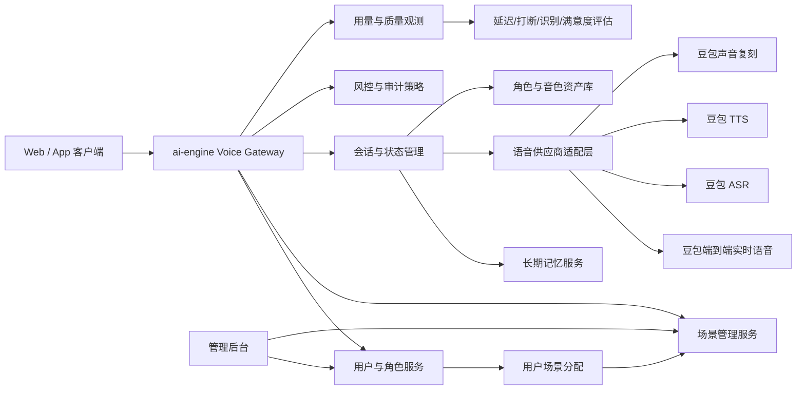

# 实时语音与豆包语音合作设计

## 背景

当前仓库已经有一个实时语音体验台：

- 前端通过浏览器麦克风采集音频，转成 16k PCM 后发给本地 WebSocket。
- FastAPI 服务作为中转，连接火山引擎豆包端到端实时语音 WebSocket。
- 已支持 O2.0 默认语音对话、SC2.0 角色扮演、音色试听、文本输入、联网参数、语速和响度参数。

用户给出的控制台入口是豆包语音资源入口，后续目标不是只接一个 API，而是把实时语音能力做成 `ai-engine` 的语音合作底座，并逐步和豆包语音产品做深度合作。

## 设计目标

1. 先把“实时语音对话”打磨成稳定可演示、可压测、可灰度的主链路。
2. 把豆包语音产品拆成可独立接入的能力模块，避免所有能力耦合在一个 Demo 页面里。
3. 为深度合作预留产品化接口，包括音色资产、角色资产、用量统计、质检评估和企业级交付。
4. 保留其他语音厂商的可替换层，但不要在早期分散主线。

## 当前可用能力判断

依据本地[豆包端到端实时语音大模型 API 接入资料](../references/doubao/realtime-voice-api-guide.pdf)和现有代码，当前最适合优先合作的是“端到端实时语音大模型 API”：

- 支持中文和英文语音到语音对话。
- 当前接口走 WebSocket，支持边上传音频边接收结果的流式交互。
- O2.0 是通用实时语音路线，适合客服、助手、教育、陪练等通用场景。
- SC2.0 是强人设路线，适合角色扮演、虚拟人、陪伴、内容 IP 化场景。
- 客户端上传音频推荐 PCM 单声道、16k、int16、小端；工程链路也支持客户端麦克风输入 opus。
- 服务端默认返回 OGG Opus；如果在 StartSession 配 TTS audio_config，也可以返回 PCM 音频流。
- O2.0 和 SC2.0 都有 12K 上下文能力，支持 System Prompt 类配置。
- O2.0 支持精品音色和唱歌能力；SC2.0 强化角色演绎、角色控制和音色克隆稳定性。
- 火山文档提到 QPM/TPM 限流，默认示例为 StartSession 维度 QPM 和 token 维度 TPM，需要产品化前做容量申请与压测。

现有代码已经覆盖了其中一部分：

- `apps/api/main.py` 已接 `wss://openspeech.bytedance.com/api/v3/realtime/dialogue`。
- 已实现 StartConnection、StartSession、TaskRequest、SayHello、ChatTextQuery、FinishSession。
- 已解析 ASR、Chat、TTS、Usage、错误事件。
- 已有 O2.0/SC2.0 音色白名单和参数校验。

## 产品合作矩阵

| 合作产品 | 适合场景 | 对 ai-engine 的价值 | 优先级 |
| --- | --- | --- | --- |
| 端到端实时语音大模型 API | 实时语音助手、客服、AI 角色、语音陪练、虚拟人对话 | 主链路，能形成实时交互体验和差异化演示 | P0 |
| 豆包语音合成模型 2.0 | 长文本播报、内容配音、通知、教学材料、有声阅读 | 补齐非实时 TTS，降低实时链路成本 | P1 |
| 流式语音识别 ASR | 会议字幕、语音输入、质检转写、实时字幕 | 作为独立识别能力，也可做实时链路旁路质检 | P1 |
| 声音复刻 / 克隆音色 2.0 | 品牌音色、企业客服音色、达人/IP 音色、角色资产 | 做出“专属声音资产”，最适合深度合作 | P1 |
| 实时同传 / 翻译字幕 | 跨语言会议、直播、课程、海外业务 | 扩展到多语种实时沟通 | P2 |
| 语音妙记 / 会议纪要 | 会后总结、待办提取、通话质检 | 和语音通话日志打通，形成企业闭环 | P2 |
| 播客 / 长音频生成 | 深度调研、文档播报、知识库音频化、品牌播客 | 把文本知识资产转成可听、可追问的内容 | P2 |
| 音乐 / 演唱能力 | 娱乐互动、虚拟人、情绪陪伴 | 适合演示和垂类玩法，不作为企业主链路 | P3 |

## 推荐架构

核心拆分：

- `Voice Gateway`：统一处理浏览器、App、服务端调用，不让前端直接感知火山协议细节。
- `User & Role Service`：先支持管理员和用户两个角色。管理员配置、体验和调整场景，用户只能选择自己被分配的场景。
- `Scene Management Service`：把客服、口语陪练、情绪陪伴、虚拟角色等场景作为独立资源管理，而不是写死在页面里；管理员可以在体验后调整模型、音色、Prompt、开场白和高级参数。
- `User Scene Assignment`：维护用户和场景的授权关系。通话开始前必须按 `user_id + scene_id` 校验，校验通过后才加载场景配置。
- `Provider Adapter`：封装豆包实时语音、ASR、TTS、声音复刻；后续要接其他厂商时只扩适配器。
- `Session Manager`：管理 StartSession、上下文、打断、结束、异常重连、会话日志。
- `Voice Asset Registry`：管理 voice_type、speaker、克隆音色、角色配置、授权状态和可用场景。
- `Observability`：记录首包延迟、ASR 最终延迟、TTS 首包延迟、端到端延迟、失败率、用量、QPM/TPM。
- `Safety & Compliance`：管理 strict_audit、敏感词、音色授权、未成年人/情感陪伴等场景约束。
- `Long-term Memory`：从对话记录中抽取稳定偏好、身份信息和长期任务，审核后在下一次会话开始前注入。

场景启动流程：

1. 用户登录后，前端只请求当前用户可用的场景列表。
2. 用户选择场景并发起通话。
3. `Voice Gateway` 校验 `user_id + scene_id` 是否有有效分配关系。
4. 校验通过后，读取场景绑定的模型、音色、Prompt、安全策略和报告口径。
5. `Session Manager` 将编译后的配置交给豆包实时语音适配器。

P0 默认用户规则：

- 管理员可以创建多个用户。
- 先按场景名称创建默认用户，例如“客服接待用户”“口语陪练用户”“虚拟角色用户”。
- 默认一个场景对应一个用户；每个默认用户只分配同名场景。
- 后续再支持一个用户绑定多个场景、用户组批量分配和客户级场景包。

语音供应商适配层不负责判断哪个用户能用哪个场景；它只消费已经授权、已经编译好的会话配置。

## 长期记忆设计

长期记忆不要直接等同于“保存全部聊天记录”。实时语音里会包含隐私、临时情绪和口误，直接全量注入会有合规和体验风险。推荐做成四层：

1. 原始记录层：保存本次会话转写、助手回复、时间、场景、音色和用户授权状态。默认只用于回放、质检和问题定位。
2. 记忆候选层：从会话里抽取可能长期有用的信息，例如用户偏好、称呼、语言水平、常用场景、长期目标。
3. 审核确认层：按策略判断是否可保存。敏感信息、健康财务身份类信息默认不自动入库；需要用户确认或业务白名单。
4. 会话注入层：下一次 StartSession 前，只取少量相关记忆写入 system_role / character_manifest / 外部 RAG 输入，不把全量历史塞进 prompt。

官方能力边界：

- 当前仓库使用的是豆包端到端实时语音大模型 WebSocket 直连接口，即 `wss://openspeech.bytedance.com/api/v3/realtime/dialogue`。这条链路里没有查到 `MemoryConfig` 字段。
- 这条链路可用的官方“记忆/上下文”能力主要是短期上下文：`dialog_id`、`dialog_context`，以及 `ConversationCreate` / `ConversationUpdate` / `ConversationRetrieve` / `ConversationTruncate` / `ConversationDelete` 事件。文档说明 `dialog_id` 可加载同一 dialog id 的对话记录，目前服务端仅支持最近 20 轮 QA 对。
- `MemoryConfig` 是火山实时音视频 RTC 的“AI 音视频互动方案 / StartVoiceChat”接口能力，用于接入记忆库（长期记忆）。如果要直接使用官方长期记忆 API，需要把当前直连 openspeech WebSocket 架构迁移或新增一条 RTC StartVoiceChat 链路。
- 因此当前 MVP 推荐先用自建长期记忆服务，再通过 `dialog_context` / `system_role` / `character_manifest` 注入；后续如果产品要走 RTC 房间、云端智能体和官方记忆库，再接 `StartVoiceChat.Config.MemoryConfig`。

接入官方 `MemoryConfig` 时，需要提前准备：

- RTC 应用信息：`VOLC_RTC_APP_ID`，以及后续真实调用 `StartVoiceChat` 所需的 AK/SK、签名和服务端 OpenAPI 调用方式。
- RTC 会话策略：`RoomId`、`TaskId` 的生成规则，以及客户端进房 token 的生成规则。
- Viking 长期记忆库：已创建并填充的记忆库 `collection_name`。
- 记忆检索过滤字段：至少提供 `user_id` 或 `assistant_id` 之一；如果记忆规则有类型划分，还需要提供 `memory_type` 列表。
- 检索参数：`limit` 和 `transition_words`。`limit` 建议先控制在 3-5 条，避免长期记忆污染实时上下文。
- IAM 授权：实时对话式 AI 服务角色需要具备访问 VikingDB / Viking 长期记忆的权限。

建议的数据模型：

| 表 | 作用 | 关键字段 |
| --- | --- | --- |
| `voice_sessions` | 一次通话会话 | `id`、`user_id`、`scene`、`started_at`、`ended_at`、`model`、`speaker` |
| `voice_turns` | 会话内逐轮记录 | `session_id`、`role`、`text`、`at`、`source`、`recording_enabled` |
| `memory_candidates` | 待确认记忆 | `user_id`、`content`、`type`、`confidence`、`source_session_id`、`status` |
| `user_memories` | 已生效长期记忆 | `user_id`、`content`、`type`、`scope`、`expires_at`、`updated_at` |
| `memory_audit_logs` | 记忆变更审计 | `memory_id`、`action`、`operator`、`reason`、`created_at` |

记忆类型建议先控制在少数几类：

- `profile`：称呼、语言、职业角色等稳定资料。
- `preference`：音色偏好、回答风格、学习偏好。
- `goal`：长期学习目标、项目目标、待持续跟踪任务。
- `constraint`：用户明确说过的禁忌、不要做的事。

实时语音接入方式：

1. 通话开始前，按 `user_id + scene` 查询相关记忆，限制 5-10 条。
2. 将记忆整理成短文本，拼进 O2.0 的 `system_role` 或 SC2.0 的 `character_manifest`。
3. 通话结束后，如果记录开关开启，从 `voice_turns` 里抽取候选记忆。
4. 候选记忆进入待确认，不直接生效；用户确认后写入 `user_memories`。
5. 用户可以查看、删除、关闭长期记忆。

第一版不要做的事：

- 不要保存完整音频作为长期记忆。
- 不要把每一句话都自动记住。
- 不要自动保存身份证、手机号、地址、健康、财务等敏感信息。
- 不要把长期记忆写死在前端 localStorage；记忆应在服务端受控存储。
- 不要把所有历史一次性注入豆包实时语音，容易污染人设和超上下文。

## 分阶段路线

### P0：实时语音主链路产品化

目标：把现有 Demo 变成可以稳定演示和试点的实时语音模块。

要做：

- 保留当前 O2.0/SC2.0 双模式，但在产品上明确：
  - O2.0：通用助手、客服、陪练。
  - SC2.0：强角色、虚拟人、内容 IP。
- 补齐会话指标：
  - WebSocket 连接耗时。
  - StartSession 到 connected 耗时。
  - 用户停止说话到首个 TTS 音频耗时。
  - ASR 文本最终返回耗时。
  - TTS 播放队列积压。
  - 错误码和关闭码。
- 增加“场景模板”而不是继续堆参数：
  - 客服接待。
  - 英语口语陪练。
  - 情绪陪伴。
  - 知识库语音问答。
  - 虚拟角色。
- 做真实音频链路检查：
  - 麦克风权限。
  - 浏览器采样率。
  - PCM 分包大小。
  - 断网/重连。
  - TTS 播放中断和用户打断。
- 梳理 `.env.local` 配置：
  - `VOLC_API_APP_ID`
  - `VOLC_API_ACCESS_KEY`
  - `VOLC_API_RESOURCE_ID`
  - `VOLC_API_APP_KEY`
  - `VOLC_WEBSEARCH_API_KEY`

验收：

- 能连续完成 30 分钟通话压测。
- 10 个并发会话下错误能被记录并可定位。
- 演示页可以一键切换至少 3 个业务场景。
- 所有失败路径都能给出可读错误，不只显示“连接失败”。

### P1：音色资产和基础语音能力

目标：从“实时语音 Demo”升级为“语音能力平台”。

要做：

- 接入独立 TTS：
  - 用于长文本播报、通知、有声内容。
  - 与实时链路共享音色资产。
- 接入独立 ASR：
  - 用于上传录音转写、实时字幕、通话质检。
  - 与实时链路返回 ASR 做一致性对比。
- 接入声音复刻：
  - 建音色注册流程。
  - 保存音色来源、授权人、训练素材、使用范围、过期时间。
  - 将克隆音色映射到实时语音 `speaker`。
- 建 `voice_assets` 数据模型：
  - `id`
  - `provider`
  - `provider_voice_type`
  - `display_name`
  - `scene`
  - `language`
  - `capabilities`
  - `license_status`
  - `enabled_for_realtime`
  - `enabled_for_tts`
  - `created_by`

验收：

- 同一个音色能同时用于实时语音和非实时 TTS。
- 一个克隆音色有完整授权记录后才能被业务场景选择。
- ASR/TTS/Realtime 三条链路有统一用量统计。

### P2：企业场景闭环

目标：让语音能力进入客服、会议、教育、知识库等真实业务。

要做：

- 会议和通话总结：
  - 录音转写。
  - 对话摘要。
  - 待办提取。
  - 关键问题归档。
- 实时字幕和同传：
  - 中英文字幕。
  - 双语会议。
  - 直播字幕。
- 知识库语音问答：
  - 先通过外部 RAG 或豆包联网能力提供知识输入。
  - 语音侧只负责自然交互，不把知识检索逻辑写死到语音适配层。
- 播客化与文档播报：
  - 将一个题目、一组文档或会议转写转成 Brief、Deep Dive、Critique、Debate 等音频形态。
  - 第一版先做“资料输入 -> 大纲 -> 脚本 -> 人工审核 -> TTS 音频”，不要直接做开放播客平台。
  - 生成内容必须保留来源、章节、脚本版本、音色资产和审核状态。
- 质检评估：
  - 识别准确率。
  - 首响延迟。
  - 打断成功率。
  - 用户满意度。
  - 敏感回复拦截率。

验收：

- 能从一次语音通话生成转写、摘要、待办和质检结果。
- 能按客户、场景、音色、模型版本统计成本和质量。
- 能从一组文档或转写生成一条可审核的播报 / 播客音频，并回看来源和章节。

### P3：深度合作与联合产品

目标：从 API 调用方变成豆包语音生态合作方。

合作方向：

- 联合场景包：
  - AI 客服语音包。
  - AI 口语陪练包。
  - 虚拟人互动包。
  - 内容 IP 语音包。
- 联合音色：
  - 品牌定制音色。
  - 行业客服音色。
  - 教育老师音色。
  - IP 角色音色。
- 联合评测：
  - 延迟指标。
  - 角色一致性。
  - 情绪表达。
  - 识别准确率。
  - 安全合规。
- 联合交付：
  - 私有化或专属资源池。
  - SLA。
  - 配额提升。
  - 专属模型/音色灰度。

## 与豆包深度合作时要提前谈清楚的问题

商务与资源：

- 是否能申请实时语音专属资源、QPM/TPM 提额和压测窗口。
- O2.0、SC2.0、声音复刻、TTS、ASR 是否按同一个账号和资源包结算。
- 克隆音色是否能同时用于实时语音和普通 TTS。
- 是否能获取更完整的音色元数据、授权状态和下线通知。

技术接口：

- WebSocket 断线、错误码、限流错误的完整枚举。
- StartSession 之后配置更新的稳定性和字段覆盖规则。
- 是否推荐客户端上传 opus 还是服务端统一转 PCM。
- 是否支持服务端按播放进度做上下文对齐。
- 是否支持外部 RAG 输入的稳定协议。
- 是否有服务端回调或用量查询 API。

合规：

- 克隆音色的授权材料要求。
- 未成年人音色、名人音色、品牌音色的限制。
- 情感陪伴、角色扮演、客服承诺类场景的审核要求。
- 录音留存、日志脱敏、用户撤回授权机制。

联合产品：

- 能否共建行业 Demo。
- 能否使用“豆包同款/剪映同款/抖音同款”等音色标签做营销展示。
- 能否获取新音色、新模型的灰度资格。
- 是否支持客户案例共创。

## 其他可合作语音产品

豆包应作为主线；其他产品建议作为备选、补充或客户指定场景接入。

| 厂商 | 可合作能力 | 适合定位 |
| --- | --- | --- |
| 科大讯飞开放平台 | ASR、TTS、同传、评测、教育语音 | 教育、考试、普通话评测、政企客户备选 |
| 阿里云智能语音交互 | 实时语音识别、录音文件识别、语音合成 | 云上企业客户、多云备选 |
| 腾讯云语音 | ASR、TTS、实时语音识别、媒体处理 | 腾讯生态客户、音视频场景备选 |
| 百度智能云语音 | ASR、TTS、语音唤醒、短语音识别 | 搜索/地图/智能硬件生态备选 |
| Azure Speech | 多语种 ASR/TTS、翻译、企业合规 | 海外和跨国企业备选 |
| Google Cloud Speech | 多语种识别、字幕、翻译链路 | 海外多语种场景备选 |
| ElevenLabs | 高表现力 TTS、声音克隆 | 海外内容创作、播客、角色配音备选 |
| OpenAI Realtime / Audio | 多模态实时交互、语音 Agent | 国际化 Agent 和多模态交互备选 |

建议策略：

- P0/P1 不做多供应商平均投入，只在适配层预留接口。
- 国内实时中文语音和豆包深度合作绑定。
- 海外、多语种、客户指定云厂商再按项目接入其他 provider。
- 评测体系必须供应商无关，避免后续无法横向比较。

## 近期产品设计建议

1. 把当前页面从“参数调试台”改成“场景体验台 + 管理员调整面板”。
2. 增加最小账号角色：管理员负责配置、体验和调整场景，用户只能选择自己被分配的场景。
3. 按场景名创建默认用户，一个默认用户只绑定一个同名场景。
4. 首页展示当前用户可用的场景，不再固定展示全量场景。
5. 每个场景绑定一套模型、音色、prompt、联网/RAG 配置。
6. 增加“通话报告”面板：转写、摘要、延迟、用量、错误。
7. 增加“音色资产”页面：官方音色、克隆音色、授权状态、试听。
8. 增加“合作模式”页面：豆包主合作、备选供应商、成本与质量对比。

## 不建议现在做的事

- 不要同时深接 5 个语音厂商，会拖慢实时语音主链路。
- 不要把 RAG、客服工单、CRM 逻辑写进语音中转层。
- 不要让前端直接持有火山密钥或拼接火山协议。
- 不要把克隆音色当普通配置项，必须先做授权和资产管理。
- 不要只看 TTS 音质，实时语音更关键的是延迟、打断、稳定性和角色一致性。

## 下一步

建议按下面顺序推进：

1. 先完成 P0 实时语音主链路压测和指标埋点。
2. 把场景从前端固定卡片升级为可配置资源，并补上管理员体验/调整能力。
3. 按场景名创建默认用户，并建立一对一场景分配。
4. 同步找豆包侧确认资源包、限流、声音复刻和 O2.0/SC2.0 后续路线。
5. 做音色资产模型，把官方音色和克隆音色纳入统一管理。
6. 接独立 ASR/TTS，形成实时对话、转写、播报三条基础链路。
7. 再进入会议纪要、同传、播客、企业场景闭环。

## 参考资料

- 火山引擎豆包语音产品页：https://www.volcengine.com/products/Music-understanding
- 豆包端到端实时语音大模型产品简介：https://www.volcengine.com/docs/6561/1594360
- 豆包端到端实时语音大模型 API 接入文档：https://www.volcengine.com/docs/6561/1594357
- 豆包语音模型列表：https://www.volcengine.com/docs/6561/2499930
- 豆包同声传译模型产品简介：https://www.volcengine.com/docs/6561/1631605
- 豆包声音复刻音色管理 API：https://www.volcengine.com/docs/6561/2235883
- 豆包语音妙记产品简介：https://www.volcengine.com/docs/6561/1798349
- 阿里云智能语音交互：https://help.aliyun.com/zh/isi/
- 腾讯云语音识别产品功能：https://cloud.tencent.com/document/product/1093/35682
- 百度智能云语音技术：https://cloud.baidu.com/doc/SPEECH/index.html
