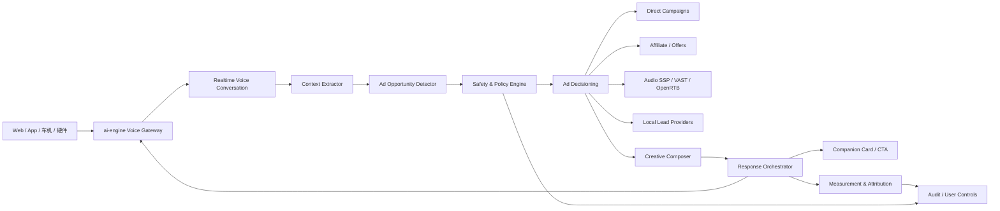

# AI 语音原生广告基础设施深度调研报告

调研日期：2026-06-10

## 结论

AI 语音原生广告基础设施存在明确机会，但机会不在“把传统音频贴片广告搬进 AI 对话”，而在“对话意图驱动的赞助推荐、可交互语音广告、交易/线索分成和广告安全治理中间层”。

传统数字音频广告已经成熟，Spotify、Amazon Ads、AdsWizz、Triton、Google DV360、The Trade Desk 等平台已经覆盖音频广告投放、程序化交易、动态插入、伴随视觉素材和基础归因。这个市场不是蓝海。

真正空缺的是实时语音 Agent 场景下的基础设施：

- 什么时候可以在对话中出现商业内容。
- 如何保证广告不影响 AI 的答案。
- 如何在纯语音、语音 + 屏幕、车机、智能硬件里清晰标注“这是广告”。
- 如何在敏感话题、未成年人、心理健康、医疗、金融、政治等场景自动禁投。
- 如何把用户的语音动作转成可归因的 CTA，例如“发给我”“预约”“跳过”“换一个”。
- 如何把广告主素材改写成适合 3-8 秒语音交互的短句，而不是 15-30 秒音频贴片。

对 `ai-engine` 来说，最适合的切入点不是自建完整广告交易市场，而是在现有实时语音网关之上做一个“Voice Native Ad Runtime”：识别广告机会、做安全过滤、召回赞助候选、生成/插入带标识的语音或卡片，并记录转化。

## 1. 范围定义

本报告中的“AI 语音原生广告基础设施”指：

> 面向实时语音 Agent、AI 陪伴、AI 客服、语音导购、车载语音、智能硬件、语音学习、语音会议等产品，在多轮语音交互中完成广告机会识别、广告决策、创意生成、合规标识、交互承接、转化归因和用户控制的一组服务。

它和传统音频广告的区别：

| 维度 | 传统音频广告 | AI 语音原生广告 |
| --- | --- | --- |
| 内容载体 | 音乐、播客、广播、有声书 | 实时多轮对话 |
| 广告位 | pre-roll、mid-roll、post-roll、动态插入 | 对话结束、任务节点、推荐节点、用户授权后的跟进 |
| 触发方式 | 内容时长、广告 break、播放队列 | 用户意图、上下文、安全策略、会话状态 |
| 创意形态 | 固定音频素材 | 语音短句、赞助答案卡、可交互 CTA、交易动作 |
| 计量 | 播放、完成、点击、到达 | 语音确认、发券、预约、下单、线索、用户信任指标 |
| 核心风险 | 打断体验、品牌安全 | 答案独立性、隐性操控、敏感话题、用户隐私 |

## 2. 为什么现在值得做

### 2.1 数字音频广告有成熟买方预算

IAB/PwC 的 2025 年美国互联网广告收入报告显示：

- 美国数字音频广告 2025 年收入达到约 84 亿美元，同比增长 10.2%。
- 播客广告 2025 年收入达到约 28.6 亿美元，同比增长 17.6%。
- 程序化广告 2025 年收入达到约 1624 亿美元，同比增长 20.5%。

来源：[IAB/PwC Internet Advertising Revenue Report FY2025](https://iabhongkong.com/sites/default/files/2026-04/IAB_PwC_Internet_Ad_Revenue_Report_Full_Year_2025_April_2026.pdf)

这说明音频广告不是从零教育市场。广告主已经接受“听觉场景可投放、可归因、可程序化购买”。但现有预算主要买的是内容流库存，不是 AI 对话库存。

### 2.2 对话式广告已经被大平台验证

OpenAI 在 2026 年开始测试 ChatGPT 广告，强调几个原则：

- 广告不影响 ChatGPT 的答案。
- 广告与答案分离，并清晰标注为 sponsored。
- 广告主看不到用户聊天内容、历史、记忆或个人细节。
- 未成年人、敏感/受监管话题附近不展示广告。
- 用户可以控制个性化、隐藏/举报广告、清除广告数据。

来源：[OpenAI - Testing ads in ChatGPT](https://openai.com/index/testing-ads-in-chatgpt/)、[OpenAI Help - Ads in ChatGPT](https://help.openai.com/en/articles/20001047-ads-in-chatgpt)

这对 AI 语音广告基础设施有直接启发：广告系统必须和回答系统逻辑分离，且广告展示需要有可解释、可审计、可关闭的控制面。

### 2.3 语音互动广告已有早期形态

Amazon Ads 已经提供标准音频广告、Interactive Audio Ads、Alexa 品牌体验和播客广告。其互动音频广告支持用户通过语音 CTA 执行动作，例如“Alexa, add to cart”“Alexa, send more info”“Alexa, remind me”。

来源：[Amazon Ads - Audio ads](https://advertising.amazon.com/solutions/products/audio-ads)

Say It Now、AdTonos 等公司也在做可交互音频广告。Say It Now 将其定位为 Actionable Audio Ads，强调 voice commerce、端到端归因、互动和交易；AdTonos 的 YoursTruly 支持听众通过 Echo、Alexa App 等设备对音频广告进行语音响应，并承接发链接、发优惠券、预约等动作。

来源：[Say It Now](https://sayitnow.ai/)、[AdTonos YoursTruly](https://www.adtonos.com/our-solutions/yourstruly/)

但这些形态多数仍围绕广播、音频内容、智能音箱广告 break，不是 AI 实时多轮对话中的原生广告。

### 2.4 广告技术标准正在走向 Agent 化

现有广告技术标准包括 VAST、OpenRTB、AdCOM、Open Measurement、GPP/TCF 等。IAB Tech Lab 已经提出 Agentic Advertising and AI 相关方向，计划把既有广告标准 agentify，并发展 AAMP、Agentic Audiences、ARTF 等协议。

来源：[IAB Tech Lab - Agentic Advertising and AI Initiatives](https://iabtechlab.com/standards/agentic-advertising-and-ai/)

同时，Ad Context Protocol（AdCP）也在探索让 AI agent 发现库存、购买媒体、构建创意、激活受众和管理报告的开放协议。

来源：[AdCP Introduction](https://docs.adcontextprotocol.org/docs/intro)

判断：行业正在从“人操作广告平台”走向“Agent 操作广告平台”。但这些协议主要解决买卖双方系统互操作，还没有直接解决“用户正在和语音 Agent 说话时，是否能插入广告、怎么插入、如何保护信任”的问题。

## 3. 可植入的广告形态

| 广告形态 | 适合场景 | 收费方式 | 建议优先级 |
| --- | --- | --- | --- |
| 赞助推荐卡 | 旅游、餐饮、课程、软件、电影、活动 | CPC / CPA / CPL | P0 |
| 语音 CTA | “发我链接”“预约”“领取优惠券”“加入日程” | CPL / CPA | P0 |
| 会话结束后推荐 | 通话总结、学习报告、客服结束页 | CPC / CPA | P0 |
| 免费额度换广告 | 免费语音分钟、AI 陪练、AI 角色 | CPM / CPV | P1 |
| 伴随视觉广告 | App、Web、车机、智能屏 | CPM / CPC | P1 |
| AI 原生口播 | AI 主播、AI 内容、电台式陪伴 | CPM / 品牌合作 | P1 |
| 品牌角色/音色 | IP 陪伴、品牌客服、活动角色 | Sponsorship | P1 |
| 本地服务线索 | 到店、维修、家政、汽车试驾 | CPL / CPA | P1 |
| 交易分成 | 订酒店、订票、买课、买会员 | CPS / 分成 | P2 |
| 传统贴片音频 | 开场、暂停、中断、结束 | CPM | 低优先级 |

不建议优先做传统 15-30 秒音频贴片。实时语音用户的心理预期是“正在和一个 Agent 协作完成任务”，贴片会破坏任务连续性，也容易降低信任。

更适合的原生形态是：

> 用户完成一个自然需求表达后，AI 先给出独立答案，再以清晰标识的方式追加一个可选赞助动作。

示例：

用户：周末想带孩子去上海周边玩两天，有什么建议？

AI：可以考虑安吉、苏州金鸡湖、上海迪士尼周边亲子酒店。我先按预算和路程帮你分三类……

AI：另外有一条赞助推荐：某亲子酒店这周有家庭套餐。要不要我把详情发到你的手机？不需要的话我继续帮你比较路线。

这个模式有三个优点：

- 用户先得到非广告答案。
- 广告明确标注为赞助。
- 用户需要主动同意后才进入商业承接。

## 4. 基础设施分层

AI 语音原生广告基础设施建议拆成 10 层：

| 层 | 作用 | 关键能力 |
| --- | --- | --- |
| Surface SDK | 接入 Web/App/车机/硬件 | 会话 ID、音频状态、屏幕能力、CTA 能力 |
| Consent & Eligibility | 用户资格和授权 | 年龄、地区、订阅层、广告开关、隐私偏好 |
| Context Extractor | 提取对话上下文 | 当前意图、任务阶段、语言、地点粗粒度、设备 |
| Opportunity Detector | 判断是否存在广告机会 | 商业意图、自然停顿、任务完成点、用户负反馈 |
| Safety & Policy Engine | 合规和品牌安全 | 敏感话题、行业禁投、未成年人、频控、黑白名单 |
| Ad Decisioning | 广告召回和排序 | 直客广告、赞助商品、联盟商品、程序化音频、兜底 |
| Creative Composer | 创意适配 | 3-8 秒语音短句、赞助标识、伴随卡片、CTA 文案 |
| Response Orchestrator | 插入对话 | 答案与广告分离、打断处理、用户拒绝、继续任务 |
| Measurement | 归因计量 | 展示、播报完成、用户语音动作、点击、发券、预约 |
| Audit & Controls | 审计和控制 | 广告历史、为什么看到、隐藏/举报、删除广告数据 |

核心判断：最难的不是“播放一段广告”，而是 Opportunity Detector、Safety & Policy Engine、Response Orchestrator 三层。

## 5. 推荐架构



在线链路要求：

- 广告机会检测不能阻塞主回答。主回答优先，广告异步候选。
- 如果广告决策超时，默认不展示广告。
- 插入广告前必须过安全策略；没有安全确认，不展示。
- 语音广告必须能被用户打断、跳过、拒绝。
- 用户拒绝后要回到原任务，而不是结束会话。

建议延迟目标：

| 环节 | 目标 |
| --- | --- |
| Opportunity Detector | 50-150ms |
| Policy Engine | 20-80ms |
| Ad Decisioning | 100-300ms，超时放弃 |
| Creative Composer | 100-500ms，P0 尽量模板化 |
| 总插入额外延迟 | 不超过 500ms，理想情况下异步预取 |

## 6. Voice Ad Opportunity 对象

建议在系统内定义一个标准化对象，作为 AI 语音广告机会的最小协议。

```json
{
  "session_id": "voice_session_123",
  "turn_id": "turn_45",
  "surface": "web_voice",
  "locale": "zh-CN",
  "user_eligibility": {
    "ads_enabled": true,
    "age_band": "adult",
    "subscription_tier": "free",
    "personalization_allowed": false
  },
  "conversation_context": {
    "intent": "travel_planning",
    "task_stage": "recommendation_complete",
    "commercial_intent_score": 0.82,
    "safety_tags": [],
    "sensitive_topic": false
  },
  "placement": {
    "type": "post_answer_sponsored_offer",
    "max_voice_duration_ms": 8000,
    "companion_card_supported": true,
    "allowed_actions": ["send_link", "save_coupon", "book_consultation", "skip"]
  },
  "policy": {
    "required_disclosure": "sponsored",
    "excluded_categories": ["health", "mental_health", "politics", "financial_services", "dating"],
    "frequency_cap_key": "user_day"
  }
}
```

这个对象的价值是把“对话理解”和“广告交易”解耦。后续可以接直客广告、联盟商品、本地服务、VAST 音频广告、OpenRTB/AdCP 类协议，但上游都只消费一个统一的广告机会描述。

## 7. 现有平台图谱

### 7.1 传统音频广告平台

| 平台 | 能力 | 对本方向的意义 |
| --- | --- | --- |
| Spotify Ads / Spotify Ad Exchange | 音频广告、播客、CTA、Ads Manager、程序化交易 | 成熟音频买方预算和创意规范来源 |
| Amazon Ads | 音频广告、Interactive Audio Ads、Alexa CTA、DSP、播客库存 | 最接近语音交互广告的大平台案例 |
| AdsWizz | AudioServe、AudioMax SSP、AudioMatic DSP、音频归因、音频 marketplace | 可作为程序化音频需求/供给参考 |
| Triton Digital | Triton Audio Marketplace、DAI、TAP、DSP 集成、音频测量 | 可作为音频 SSP/DAI 参考 |
| Google DV360 | 音频素材、VAST 音频、伴随创意、第三方追踪 | 说明音频广告已纳入程序化标准 |
| The Trade Desk | 程序化音频购买 | 买方侧预算入口 |
| Acast / iHeart / SiriusXM Media | 播客、广播、创作者音频广告 | 内容流音频库存 |

来源：

- [Spotify Audio Ads](https://ads.spotify.com/en-US/ad-formats/audio-ads/)
- [Amazon Audio Ads](https://advertising.amazon.com/solutions/products/audio-ads)
- [AdsWizz Marketplace](https://www.adswizz.com/podcasters/marketplace/)
- [Triton Audio Marketplace](https://tritondigital.com/solutions/audio-advertising/tam)
- [Google DV360 Audio Creatives](https://support.google.com/displayvideo/answer/7670534?hl=en)

### 7.2 语音互动广告平台

| 平台 | 能力 | 局限 |
| --- | --- | --- |
| Amazon Interactive Audio Ads | Alexa 语音 CTA、加购、提醒、发送信息 | 主要在 Amazon/Alexa 生态内 |
| Say It Now | Actionable Audio Ads、voice commerce、发券、CRM、交易归因 | 多围绕智能音箱/音频广告，而非 AI 多轮对话 |
| AdTonos YoursTruly | Echo/Alexa App 上的互动音频广告，支持发链接、预约等动作 | 以音频广告 break 触发，不是实时对话原生 |
| Instreamatic 等 | 语音响应式音频广告 | 生态和标准化程度有限 |

判断：这些公司证明“用户可以对广告说话”，但还没有解决“广告如何成为 AI Agent 回答流程的一部分”。

### 7.3 Agentic advertising 协议

| 协议/方向 | 解决什么 | 和语音原生广告的关系 |
| --- | --- | --- |
| VAST | 视频/音频广告素材和追踪标准 | 可承接传统音频广告资产 |
| OpenRTB | 实时竞价 | 可承接程序化需求 |
| IAB AAMP / ARTF / Agentic Audiences | Agent 化广告管理、受众信号、标准扩展 | 未来可能成为买卖方 Agent 互操作基础 |
| AdCP | AI agent 发现库存、创建媒体购买、创意、报告 | 更偏媒体购买工作流，不直接定义语音插入策略 |

来源：[IAB VAST](https://iabtechlab.com/standards/vast/)、[IAB OpenRTB](https://iabtechlab.com/standards/openrtb/)、[IAB Agentic Advertising](https://iabtechlab.com/standards/agentic-advertising-and-ai/)、[AdCP](https://docs.adcontextprotocol.org/docs/intro)

## 8. 蓝海判断

### 8.1 红海部分

以下方向不建议作为创业/产品主线：

- 再做一个音频 SSP。
- 再做一个播客广告 marketplace。
- 再做一个音频素材生成工具。
- 再做一个通用 DSP。
- 用贴片广告粗暴变现 AI 语音会话。

原因：已有平台有库存、买方、测量、销售团队和行业关系，后来者很难只靠“AI”重新切入。

### 8.2 蓝海部分

蓝海集中在“AI 语音 Agent 的广告运行时”：

1. 对话广告机会检测。
2. 广告与答案分离的运行机制。
3. 语音广告标识和用户控制。
4. 敏感场景禁投和未成年人保护。
5. 可交互 CTA 和转化归因。
6. 面向实时语音的短创意生成。
7. 语音 + 屏幕伴随卡片统一展示。
8. 对广告主的意图型投放产品：例如“只在用户明确找亲子酒店时出现”。

这类基础设施现在没有明显的全球事实标准，也没有一个横跨 AI 语音 App、车机、智能硬件、AI 陪伴和客服 Agent 的独立平台。

### 8.3 机会窗口

机会窗口大约来自三类变化：

- AI 对话平台开始探索广告，说明“对话式广告”商业化路径成立。
- 实时语音 Agent 会成为新的高频入口，尤其在陪伴、学习、车载、硬件、客服中。
- 广告行业正在 Agent 化，但标准还在早期，尚未完全锁定。

判断：如果能先拿到若干 AI 语音场景的真实会话数据，并验证用户接受度和 CPA/CPL 转化，就有机会形成垂直基础设施。

## 9. 合规与信任原则

### 9.1 国际通用原则

参考 OpenAI 和 FTC 的公开原则，AI 语音广告必须至少满足：

- 广告不改变 AI 的自然答案。
- 广告要和自然答案分离。
- 语音中要明确说出“赞助推荐”“广告”或等价标识。
- 广告主不能获得原始对话、历史记忆、个人细节。
- 用户可以跳过、隐藏、举报、关闭个性化。
- 敏感话题不出现广告。
- 受监管行业谨慎或禁入。

FTC 对 native advertising 的要求核心是透明：广告不能让用户误以为它不是广告；如果需要披露，披露必须清楚、显著。

来源：[FTC - Native Advertising: A Guide for Businesses](https://www.ftc.gov/business-guidance/resources/native-advertising-guide-businesses)

### 9.2 中国场景要求

如果服务面向中国境内公众，AI 语音广告基础设施还要考虑：

- 《生成式人工智能服务管理暂行办法》覆盖生成文本、图片、音频、视频等内容服务。
- 《互联网信息服务深度合成管理规定》要求深度合成服务提供标识和追溯。
- 《人工智能生成合成内容标识办法》自 2025-09-01 起施行，明确生成合成内容包括音频，标识包括显式和隐式标识。
- 《人工智能拟人化互动服务管理暂行办法》已于 2026-04-10 公布，将自 2026-07-15 起施行，覆盖通过文字、图片、音频、视频等方式进行情感互动的拟人化服务。

来源：

- [生成式人工智能服务管理暂行办法](https://www.cac.gov.cn/2023-07/13/c_1690898327029107.htm)
- [互联网信息服务深度合成管理规定](https://www.cac.gov.cn/2022-12/11/c_1672221949354811.htm)
- [人工智能生成合成内容标识办法](https://www.cac.gov.cn/2025-03/14/c_1743654684782215.htm)
- [人工智能拟人化互动服务管理暂行办法](https://www.cac.gov.cn/2026-04/10/c_1777558395078289.htm)

对产品的直接影响：

- 广告语音如果由 AI 生成，需要有生成合成内容标识策略。
- 拟人化陪伴场景不能把诱导沉迷、情感依赖、替代社交作为目标。
- 未成年人场景默认禁用或强限制广告。
- 用户交互数据不能随意给第三方广告主。
- 如果使用声音复刻或品牌声音，必须有授权、撤回和审计记录。

## 10. 适合 `ai-engine` 的落地路线

当前仓库已有实时语音网关和豆包实时语音接入基础，因此建议从“对话运行时”切入，而不是从广告平台后台做起。

### P0：本地广告机会检测和赞助推荐

目标：证明在实时语音对话中插入“可选赞助推荐”不会明显破坏体验。

要做：

- 定义 `VoiceAdOpportunity` 对象。
- 在会话结束、任务阶段完成、用户明确询问推荐时触发机会检测。
- 先用本地 mock campaign，不接外部广告平台。
- 只支持赞助卡片 + 语音短句。
- 必须支持“跳过”“不要再出现”“为什么推荐我”。
- 记录曝光、跳过、点击、语音确认、投诉。

建议先测场景：

- 旅游/周末出行。
- 餐饮/本地生活。
- 课程试听/英语陪练。
- 软件工具/效率工具。
- 电影、演出、活动。

先禁用：

- 医疗、心理健康。
- 金融、保险、贷款。
- 政治、社会议题。
- 成人、交友、博彩。
- 未成年人画像下的广告。

### P1：广告安全策略和可交互 CTA

目标：把广告从“展示”升级成“可归因动作”。

要做：

- 增加 `AdPolicyEngine`。
- 增加频控、行业禁投、敏感话题禁投。
- 增加语音动作识别：发链接、发券、预约、收藏、跳过。
- 增加伴随卡片展示。
- 增加广告历史和用户控制页。
- 引入简单直客广告后台。

### P2：外部需求接入

目标：接入真实商业需求。

优先顺序：

1. 直客赞助活动。
2. 联盟商品/优惠券。
3. 本地服务线索。
4. 垂类 API，例如酒店、课程、软件 SaaS。
5. 程序化音频广告，仅作为兜底，不作为主线。

暂不建议一开始直接接 OpenRTB/VAST 做实时竞价。原因是实时语音里的广告位语义复杂，传统竞价返回的音频素材不一定适合当下对话，也难以保证答案分离和敏感场景安全。

### P3：Agentic advertising 兼容

目标：当市场标准更清晰后，再考虑对接 AdCP/AAMP 类协议。

要做：

- 把 `VoiceAdOpportunity` 映射成外部 agentic ad brief。
- 支持 buyer agent 查询可用广告产品。
- 支持 seller agent 返回赞助候选和创意约束。
- 支持广告主上传品牌规则、禁用场景和 CTA 能力。

## 11. 商业模式

| 模式 | 适用阶段 | 说明 |
| --- | --- | --- |
| SDK / API 服务费 | P0-P1 | 向 AI 语音 App / 硬件 / 客服系统收取调用费 |
| 广告流水分成 | P1-P2 | 对 CPA/CPL/CPS 结果抽成 |
| Campaign 管理费 | P1-P2 | 为品牌配置语音赞助活动 |
| 线索分成 | P2 | 本地服务、教育试听、汽车试驾 |
| 企业私有化 | P2 | 企业客服、品牌语音导购、车企语音系统 |
| 数据/归因服务 | P2-P3 | 聚合非个人化报表、转化分析、A/B 实验 |

不建议早期只靠 CPM。AI 语音广告的优势不是“多播几次”，而是“在强意图时让用户主动做动作”。

## 12. 关键指标

用户体验指标：

- 广告跳过率。
- 广告后会话继续率。
- 广告后留存变化。
- 用户投诉/举报率。
- “广告是否有帮助”反馈。
- 用户是否关闭广告个性化。

广告效果指标：

- Opportunity rate：每 100 次会话产生多少可投广告机会。
- Eligible rate：广告机会中过安全策略的比例。
- Fill rate：有合适广告可展示的比例。
- Voice CTA rate：用户说“发我/预约/领取”的比例。
- Conversion rate：发券、预约、购买、注册等转化。
- Cost per qualified lead。

系统指标：

- 广告决策延迟。
- 超时放弃率。
- 策略误杀/漏放。
- 敏感话题误触发。
- 语音动作识别准确率。
- 审计日志完整率。

## 13. 风险

### 13.1 信任风险

如果用户觉得 AI 为了广告改变答案，产品信任会迅速下降。广告系统必须和回答系统分离，并保留“为什么出现”的解释能力。

### 13.2 合规风险

语音广告容易被用户感知为“AI 主动建议”，比网页广告更有说服力。健康、心理、金融、政治、未成年人相关场景应默认禁投。

### 13.3 体验风险

实时语音比文本更怕打断。广告应放在任务完成点、总结后、用户明确询问商业推荐后，而不是在用户思路中途插入。

### 13.4 归因风险

纯语音没有天然点击。必须用“发链接/发券/预约/收藏/打开卡片”等动作承接，不能只统计播放。

### 13.5 广告主素材风险

传统广告主提供的 15-30 秒素材不适合 AI 对话。需要创意压缩、合规改写、TTS/音色授权、品牌语气控制。

## 14. 产品建议

建议产品定位：

> AI 语音 Agent 的原生商业化运行时，帮助语音应用在不破坏用户信任的前提下展示可解释、可跳过、可交互、可归因的赞助推荐。

第一版不要叫“广告平台”，而叫“赞助推荐与转化引擎”。这样更容易被 AI 语音产品接受，也更符合用户体验。

第一版核心能力：

1. `VoiceAdOpportunity`：统一广告机会对象。
2. `AdPolicyEngine`：禁投、频控、敏感话题、年龄、行业策略。
3. `SponsoredRecommendation`：赞助推荐卡片和短语音。
4. `VoiceCTA`：发链接、发券、预约、跳过。
5. `AdAuditLog`：广告曝光、原因、素材、策略命中、用户动作。
6. `UserControls`：隐藏、举报、关闭个性化、清除广告历史。

第一批 demo 场景：

- AI 旅游规划：亲子酒店、周边游、景点票务。
- AI 英语陪练：课程试听、词典/学习工具会员。
- AI 生活助手：餐饮团购、本地活动。
- AI 客服/导购：售后延保、配件、优惠券。
- AI 陪伴：只允许低风险生活消费，不进入情感操控和敏感行业。

## 15. 最终判断

AI 语音原生广告基础设施是一个窄但真实的蓝海。

它的价值不在于替代 Spotify、AdsWizz、Triton 这类音频广告平台，而在于补上它们不擅长的一层：实时语音 Agent 的语义广告运行时。

如果 `ai-engine` 要继续做实时语音和语音陪伴/Agent 底座，建议把这件事作为商业化能力的 P1 方向预研：P0 先做内部 mock 广告和体验验证，确认用户接受度、插入时机、跳过率和 CTA 转化，再决定是否接真实广告主。

一句话：

> 不要做“语音里插广告”，要做“AI 语音任务完成后的可信赞助动作”。
