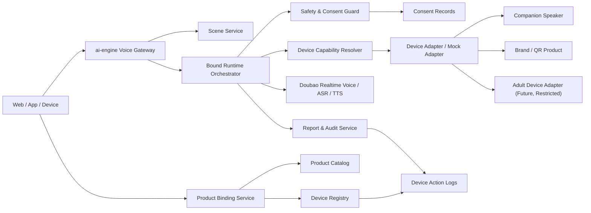

# AI 与现实产品 / 硬件绑定深度调研报告

调研日期：2026-06-10

## 结论

`ai-engine` 值得继续研究“AI 绑定现实产品”的方向，但第一步不建议自研硬件量产，也不建议直接做成人用品 C 端 AI 伴侣。更稳妥的切入点是：

> 把 `ai-engine` 做成“现实产品 AI 绑定层”：通过语音 Agent、场景模板、设备状态、控制权限、长期记忆和合规审计，把已经存在的硬件或商品变成可对话、可解释、可远程配置的体验。

优先顺序建议：

1. 陪伴音响 / 桌面陪伴设备：最适合承接当前实时语音能力，场景边界清楚，适合做 P0 演示。
2. 品牌商品 / IP 周边：可以把普通实物商品绑定到角色、音色、售后、内容和会员服务，不需要先碰复杂硬件。
3. 成人亲密设备：市场和连接生态都存在，但隐私、同意、年龄、平台分发和内容审核风险极高，只能作为 P1/P2 的合规研究分支，不能作为 P0。

核心判断：

- AI 硬件失败案例已经证明：单独做一个“新设备 + 新 OS + 新交互”的风险很高。
- 智能音箱和智能屏仍然是成熟入口，但通用助手正在被 Amazon Alexa+、Google Gemini for Home 这类大平台升级。
- 成人亲密设备不是空白市场，Lovense、We-Vibe、Kiiroo、Buttplug.io 等已经证明“App 控制、远程控制、互动内容同步、开放协议”是成熟需求。
- 真正的新机会不是再做一个控制 App，而是做“对话意图 -> 安全判断 -> 设备动作 / 商品服务 / 会员权益”的中间层。
- 对 `ai-engine` 来说，先做“可绑定、可审计、可禁用、可替换设备”的服务层，比自己造硬件更现实。

## 1. 范围定义

本报告中的“现实产品 / 硬件绑定”指：

> 用户购买或持有一个现实中的设备、商品、周边、服务卡、包装码或会员权益后，可以把它和 AI 角色、语音 Agent、设备控制、内容服务、售后流程或长期记忆绑定起来。

它不是单纯的 IoT 控制，也不是单纯的 AI 聊天。

| 维度 | 普通 IoT / App 控制 | AI 现实产品绑定 |
| --- | --- | --- |
| 入口 | App 按钮、遥控器、语音指令 | 多轮语音 / 文本 Agent |
| 对象 | 单个设备状态和动作 | 设备、商品、用户、场景、服务权益 |
| 交互 | 打开、关闭、调节参数 | 理解意图、解释边界、建议动作、确认后执行 |
| 数据 | 设备 ID、状态、日志 | 场景、记忆、同意记录、安全策略、售后记录 |
| 风险 | 误触发、账号泄露 | 误导、依赖、隐私、成人内容、远程操控滥用 |
| 商业化 | 硬件利润、耗材、会员 | 硬件 + AI 服务包 + 场景包 + 品牌/IP 运营 |

当前 `ai-engine` 更适合做服务层，而不是硬件厂：

- 负责语音对话、场景配置、权限校验、安全策略、报告和日志。
- 对接第三方设备 SDK、蓝牙网关、App、Web、小程序或硬件网关。
- 用统一“设备动作协议”屏蔽不同硬件差异。
- 保持所有高风险动作都需要明确同意、可撤回、可追溯。

## 2. 为什么现在值得做

### 2.1 通用 AI 助手正在进入家庭硬件

Amazon 在 2025 年发布 Alexa+，定位为更会对话、更个性化、能完成任务的下一代 Alexa，并强调它可以跨 Echo、Fire TV、Ring 等设备工作。Google 在 2025 年发布 Gemini for Home，明确会逐步替代 Google Assistant on speakers and displays，并强调更自然的家庭语音交互和智能家居控制。

这说明一个趋势已经很清楚：

- 家庭设备会从“命令式语音助手”升级到“对话式 Agent”。
- 用户会期望设备理解上下文，而不是只识别固定指令。
- 设备厂商需要的不是单点 TTS/ASR，而是完整的场景、权限、记忆和动作编排。

对 `ai-engine` 的启发：

- 不要和 Alexa / Gemini 争夺通用家庭入口。
- 应该服务于更垂直的设备和品牌，例如陪伴音响、适老设备、学习硬件、IP 周边、成人亲密设备、售后设备、体验店装置。
- 垂直设备需要更强的场景安全和业务配置，而不是一个通用助手。

### 2.2 AI 硬件失败案例暴露了“云依赖 + 价值不清”的风险

Humane AI Pin 在 2025 年被 HP 收购相关 AI 能力和 IP 后，产品线停止销售，既有设备很快失去云端核心功能。Moxie 儿童陪伴机器人也曾因原公司 Embodied 关闭而引发用户对云服务中断、儿童情感依赖和硬件变砖的担忧。

这些案例给硬件绑定产品三个教训：

1. 不要把全部产品价值锁死在不可替代的云服务上。
2. 用户买了实物后，会默认它至少应保留基本可用能力。
3. 陪伴型 AI 一旦让用户形成情感关系，就必须有停服、迁移、告别、数据导出和离线兜底方案。

对 `ai-engine` 的要求：

- 设备绑定必须支持“云能力降级”。
- 通话、记忆、设备动作和授权记录要能导出或迁移。
- 不能承诺“永久陪伴”。
- 高情感依赖场景必须设置时长提醒、关系边界和停服预案。

### 2.3 成人亲密设备已经有连接生态

成人亲密设备已经不是“单机硬件”：

- Lovense Remote 支持本地控制、远程控制、聊天 / 语音 / 视频和控制链接；Lovense 也提供 Android / iOS SDK。
- We-Vibe App 支持连接设备、直接控制、长距离伴侣控制、聊天和视频。
- Kiiroo FeelConnect 把设备控制、互动内容、伴侣连接和训练场景放在同一 App 体系里。
- Buttplug.io 是开源亲密硬件控制库和应用生态，支持多品牌、多协议和多平台。

这说明市场已经验证了几个需求：

- 远距离亲密连接。
- 内容与设备动作同步。
- 自定义模式、强度和节奏。
- 伴侣授权控制。
- 直播、游戏、VR、音频和视频内容联动。

但这也说明 `ai-engine` 不应该从“控制器”重新做起。成熟厂商已经有硬件、App、SDK、蓝牙协议和内容生态。更有价值的位置是：

> 做 AI 对话和安全编排层：识别用户意图、确认同意、生成可执行但受限的设备动作、记录授权、处理撤回、做风险拦截和会后审计。

### 2.4 亲密设备隐私事故说明风险不是理论问题

We-Vibe 曾因联网设备和 App 数据采集引发隐私诉讼并达成和解。这个案例说明成人设备的数据不是普通 IoT 数据，而是高度敏感的个人信息和行为信息。

因此成人设备绑定必须默认采用最高隐私等级：

- 不记录不必要的具体使用细节。
- 不把亲密行为、偏好、强度、时长等做无确认的长期画像。
- 不把对话文本直接转成可被第三方长期识别的行为标签。
- 不允许第三方或伴侣获得永久控制权。
- 所有控制都必须是短时、明确、可撤回、可审计的会话授权。

## 3. 市场与产品形态

### 3.1 AI 陪伴硬件

| 类型 | 代表形态 | 用户需求 | 风险 | 对 `ai-engine` 的机会 |
| --- | --- | --- | --- | --- |
| AI 挂件 / 胸针 | Friend、Humane AI Pin 类设备 | 随身记录、即时回应、陪伴感 | 隐私争议、价值不清、硬件成本、社交尴尬 | 只作为反例研究，不建议 P0 |
| 桌面陪伴音响 | AI 音箱、桌面屏、陪伴灯 | 在家说话、提醒、复盘、播放内容 | 同质化、通用助手竞争 | 推荐 P0 |
| 适老陪伴设备 | ElliQ、智能屏、家庭问候设备 | 主动问候、提醒、家属摘要 | 医疗边界、紧急救援承诺 | 推荐试点 |
| 儿童陪伴机器人 | Moxie 类机器人 | 教育、社交、情绪陪伴 | 未成年人、停服、情感依赖 | 不建议当前阶段 |
| IP / 品牌周边 | 玩偶、摆件、盲盒、桌搭 | 角色互动、粉丝运营、纪念品增值 | IP 授权、内容审核 | 推荐 P1 |

陪伴音响比 AI 挂件更适合第一阶段：

- 家庭或桌面场景天然允许语音外放，不像随身设备那样容易引发旁人隐私问题。
- 可以先做低硬件复杂度：麦克风、扬声器、灯效、按键、网络状态即可。
- 可以支持“不会说话也可用”：蓝牙音箱、白噪音、定时提醒、离线按键。
- 更容易和当前 `ai-engine` 的实时语音网关对接。

### 3.2 成人亲密设备

成人亲密设备建议拆成四层，而不是直接说“AI 成人用品”：

| 层 | 说明 | 是否建议做 |
| --- | --- | --- |
| 设备连接层 | 蓝牙、本地 App、厂商 SDK、云 API | 不自研硬件协议，优先接已有 SDK |
| 动作编排层 | 将“强度、模式、节奏、时长”抽象成受限动作 | 可以研究，但必须加安全限幅 |
| 对话同意层 | AI 识别意图后要求用户确认、可撤回 | `ai-engine` 可以做 |
| 成人内容层 | 显性成人对话、成人剧情、生成成人内容 | P0 不做 |

推荐边界：

- 可以研究“合规成人用户 + 明确设备动作授权 + 非露骨语言”的设备控制。
- 不做未成年人可接触的任何成人体验。
- 不做公开角色广场。
- 不做色情内容生成。
- 不做伪装真人、伪装伴侣、诱导依赖或操控用户情绪的角色。
- 不接入无法证明用户年龄、同意和撤回能力的平台。

成人设备的真实产品机会：

| 场景 | 价值 | 必要约束 |
| --- | --- | --- |
| 伴侣远程控制辅助 | 把控制从复杂 App 操作变成自然语言确认 | 双方成年人、短时授权、随时断开 |
| 内容同步解释器 | 把音频/视频/故事的节奏转为设备动作 | 内容来源合规、用户主动选择 |
| 私密训练 / 健康管理 | 用户自我设置节奏和提醒 | 不做医疗诊断，不记录敏感细节 |
| 设备客服和售后 | 连接、清洁、保养、故障排查 | 安全说明优先，不收集亲密行为 |
| 品牌会员服务 | 场景包、教程、设备保养、权益兑换 | 不做诱导消费和过度使用 |

### 3.3 品牌商品 / IP 周边

这类场景风险低于成人硬件，且很适合验证“现实产品绑定”：

- 包装二维码绑定 AI 角色或语音。
- IP 玩偶绑定角色语音、故事、问候和会员内容。
- 课程书、实体卡片绑定学习陪练。
- 音响、灯、香薰、桌搭绑定睡前复盘、白噪音和日程提醒。
- 售后卡绑定设备说明书、故障排查和客服转接。

这种模式的优点：

- 设备动作可以很轻，甚至没有硬件控制也能成立。
- 用户购买实物后，AI 服务变成增值权益。
- 更适合 B2B2C：品牌方负责商品和渠道，`ai-engine` 负责 AI 绑定层。
- 可以先用二维码 / 序列号 / NFC 绑定，不需要复杂供应链。

## 4. 绑定模式设计

现实产品绑定可以分成 6 种模式：

| 模式 | 用户动作 | AI 能力 | 适合产品 |
| --- | --- | --- | --- |
| 扫码激活 | 扫包装码 / 设备码 | 激活角色、权益、说明书 | IP 周边、课程、玩具、音响 |
| 设备配对 | 蓝牙 / Wi-Fi / App 配对 | 读取设备状态、下发动作 | 音响、灯、亲密设备、健康设备 |
| 场景包绑定 | 选择设备所属场景 | 加载 Prompt、音色、安全策略 | 陪伴音响、适老设备 |
| 会员权益绑定 | 输入兑换码或购买服务包 | 限定语音时长、角色、内容 | 品牌商品、硬件套装 |
| 伴侣 / 家属授权 | 邀请另一用户加入 | 分享摘要、远程控制、提醒 | 适老、家庭、伴侣设备 |
| 售后绑定 | 上传订单 / SN | 设备说明、故障排查、工单 | 所有实体产品 |

P0 不需要接真实硬件协议。可以先做“虚拟设备绑定”：

- 用户选择一个虚拟陪伴音响。
- 系统生成设备 ID。
- 设备有在线 / 离线、音量、灯效、模式、播放状态。
- AI 对话中只能请求这些安全动作。
- 用户确认后才执行。

这能先验证产品体验和协议边界，再决定是否接硬件。

## 5. 推荐落地产品

### 产品名称

暂定：`Bound Voice Runtime`

定位：

> 面向智能硬件、品牌商品、IP 周边和高合规垂直设备的 AI 绑定运行时，提供语音对话、设备动作编排、产品激活、权限授权、场景模板、长期记忆、合规审计和会后报告。

### 第一阶段主线：陪伴音响体验台

推荐先做一个“陪伴音响 / 桌面陪伴设备”原型，而不是成人设备：

- 复用当前实时语音链路。
- 增加虚拟设备状态。
- 增加设备动作确认。
- 增加用户和设备绑定关系。
- 增加场景模板：晚间复盘、白噪音陪伴、学习陪练、适老问候。
- 增加设备端事件：按下静音、长按结束、音量变化、灯效状态。

#### 核心体验

用户第一次打开设备：

1. App / Web 扫描设备二维码。
2. 绑定到用户账号。
3. 选择场景：晚间复盘、学习陪练、适老问候。
4. 选择音色和开场白。
5. 设备进入待机。

日常使用：

1. 用户说“我想聊聊今天”。
2. AI 开始语音对话。
3. AI 可以建议“我帮你把灯效调暗一点，放 10 分钟白噪音吗？”
4. 用户确认。
5. 系统执行设备动作并记录。
6. 会后生成摘要和设备动作日志。

### 第二阶段分支：品牌商品 / IP 绑定

在陪伴音响跑通后，可以用更轻的形式验证商业化：

- IP 玩偶：扫码激活角色语音。
- 课程卡：扫码激活口语陪练。
- 香薰 / 灯 / 音响：扫码激活睡前陪伴场景。
- 售后卡：扫码进入语音说明书和客服 Agent。

这类场景不一定需要设备控制，重点是“实物购买 -> AI 服务权益”。

### 第三阶段研究分支：成人亲密设备

成人设备只建议在满足以下条件后进入：

- 有明确成人年龄验证。
- 有清晰的地区合规判断。
- 有厂商 SDK / API 合作，不逆向协议。
- 有双向同意和随时撤回机制。
- 有最小化数据策略。
- 有平台分发策略，避免应用商店审核不可控。
- 有独立安全评审。

第一版成人设备也不应做显性成人聊天，而应从“设备客服、连接说明、会话授权、模式安全限制”做起。

## 6. MVP 范围

### P0：现实产品绑定体验台

目标：把 `ai-engine` 从“语音陪伴体验台”升级为“可绑定现实产品的语音 Agent 原型”。

只做 6 件事：

1. 产品 / 设备绑定：支持设备码、商品码或虚拟设备 ID 绑定到用户。
2. 场景模板：为绑定产品加载不同场景配置。
3. 设备状态：展示在线状态、音量、灯效、模式、最近动作。
4. 动作确认：AI 只能提出动作建议，用户确认后执行。
5. 通话报告：记录对话摘要、设备动作、风险标签和用量。
6. 合规提示：AI 身份、设备动作确认、隐私说明、未成年人限制。

不做：

- 不做真实硬件量产。
- 不做成人内容生成。
- 不做成人设备真实控制。
- 不做开放角色广场。
- 不做未成年人亲密陪伴。
- 不做医疗诊断、心理治疗、紧急救援承诺。
- 不做跨品牌设备协议大一统。

### P0 默认产品类型

| 产品 | 状态 | 说明 |
| --- | --- | --- |
| 虚拟陪伴音响 | 必做 | 模拟真实设备绑定和控制 |
| 品牌商品二维码 | 必做 | 验证商品权益绑定 |
| 售后说明书 Agent | 可选 | 验证实物商品服务化 |
| 成人设备 | 不做真实控制 | 只在报告中保留合规研究 |

## 7. 产品功能设计

### 7.1 产品资源

新增 `products` 概念，区别于已有 `scenes`：

| 字段 | 含义 |
| --- | --- |
| `id` | 产品 ID |
| `product_type` | `speaker` / `merchandise` / `toy` / `adult_device` / `service_card` |
| `name` | 产品名称 |
| `brand` | 品牌 |
| `status` | 草稿 / 已上架 / 已下架 |
| `default_scene_id` | 默认场景 |
| `allowed_scene_ids` | 可用场景列表 |
| `safety_policy_id` | 默认安全策略 |
| `binding_policy_id` | 绑定策略 |
| `support_policy_id` | 售后策略 |

### 7.2 设备资源

设备是某个产品的具体实例：

| 字段 | 含义 |
| --- | --- |
| `id` | 内部设备 ID |
| `product_id` | 所属产品 |
| `serial_no` | 序列号 / 设备码 |
| `owner_user_id` | 绑定用户 |
| `status` | 未激活 / 已绑定 / 已解绑 / 冻结 |
| `online_state` | 在线 / 离线 / 模拟 |
| `firmware_version` | 固件版本，可为空 |
| `last_seen_at` | 最近在线时间 |
| `capability_profile_id` | 能力描述 |

### 7.3 设备能力描述

用能力描述屏蔽具体硬件：

```json
{
  "device_type": "companion_speaker",
  "capabilities": {
    "audio_playback": true,
    "microphone": true,
    "volume": { "min": 0, "max": 100 },
    "light": {
      "modes": ["off", "warm", "breathing", "focus"]
    },
    "white_noise": {
      "tracks": ["rain", "ocean", "fireplace"],
      "max_minutes": 30
    }
  },
  "requires_user_confirmation": [
    "start_recording",
    "share_report",
    "change_long_term_memory"
  ]
}
```

成人设备如果未来接入，必须用更严格的能力描述：

- 不暴露原始厂商命令给 LLM。
- 所有动作必须有强度、时长、频率上限。
- 不允许永久授权。
- 不允许旁路控制。
- 每次远程控制都需要当前会话同意。

### 7.4 绑定关系

| 表 | 作用 |
| --- | --- |
| `product_bindings` | 用户和产品 / 设备 / 商品码的绑定关系 |
| `device_sessions` | 一次设备在线会话 |
| `device_action_logs` | AI 建议、用户确认、动作执行结果 |
| `consent_records` | 同意、撤回、过期、授权对象 |

关键规则：

- 一个设备同一时间只能有一个 owner。
- 家属 / 伴侣 / 客服只能是 delegate，不是 owner。
- delegate 权限必须可撤回、可过期。
- 高风险动作必须记录 `requested_by`、`confirmed_by`、`executed_at`、`result`。
- 用户解绑设备后，设备不能继续访问用户记忆。

### 7.5 动作编排

LLM 不直接调用硬件 API，而是输出受限动作意图：

```json
{
  "intent": "set_white_noise",
  "reason": "用户确认睡前放松",
  "requires_confirmation": true,
  "params": {
    "track": "rain",
    "duration_minutes": 10,
    "volume": 35
  }
}
```

服务端负责：

1. 校验用户是否绑定设备。
2. 校验场景是否允许该动作。
3. 校验设备能力是否支持。
4. 校验参数是否在安全范围内。
5. 要求用户确认。
6. 执行动作。
7. 写入日志和报告。

## 8. 系统架构



模块说明：

- `Product Catalog`：管理产品类型、品牌、默认场景、可用场景和绑定策略。
- `Device Registry`：管理具体设备实例、序列号、状态、能力和 owner。
- `Product Binding Service`：处理扫码、激活、解绑、转让、冻结。
- `Bound Runtime Orchestrator`：把对话意图、场景、设备能力和安全策略编排起来。
- `Device Capability Resolver`：把不同设备统一成能力模型。
- `Device Adapter`：真实设备 SDK 或 mock 设备适配层。
- `Safety & Consent Guard`：处理年龄、同意、撤回、动作确认、敏感内容。
- `Report & Audit Service`：生成对话报告和设备动作审计。

## 9. 成人亲密设备专项边界

成人设备方向可以研究，但必须单独立项、单独评审、单独上线开关。

### 9.1 必须满足的前置条件

| 条件 | 要求 |
| --- | --- |
| 年龄 | 只允许成年人，且要有可信年龄确认 |
| 地区 | 根据地区法规决定是否开放 |
| 同意 | 每次远程控制必须明确同意 |
| 撤回 | 用户随时可以一键停止 |
| 数据 | 默认不保存亲密行为细节 |
| 记忆 | 不写入未经确认的亲密偏好 |
| 内容 | 不生成色情内容，不做未成年人可接触内容 |
| 平台 | 提前评估 App Store、Google Play、小程序、支付渠道限制 |
| 审计 | 高风险会话单独审计和脱敏 |

### 9.2 不允许的能力

- 未成年人使用或旁观。
- 诱导用户进行成人行为。
- 伪装成人伴侣或真人。
- 在用户未确认时执行设备动作。
- 让伴侣 / 第三方获得长期不可见控制权。
- 保存可识别的亲密行为时间线。
- 把成人行为偏好用于广告推荐。
- 以健康、治疗、改善性功能等名义做无资质承诺。

### 9.3 可以研究的低风险切口

| 切口 | 说明 |
| --- | --- |
| 连接客服 | 帮用户理解如何安全连接、断开、清洁和保养设备 |
| 权限说明 | 用自然语言解释谁能控制、多久过期、如何撤回 |
| 模式管理 | 用户主动创建本地模式，不自动上传敏感细节 |
| 安全停机 | 一键停止所有动作，撤销远程会话 |
| 数据删除 | 删除设备绑定、授权记录和可识别日志 |

第一阶段不要从“AI 亲密伴侣”切入，应该从“用户控制权和隐私安全”切入。

## 10. 合规与安全

截至 2026-06-10，产品设计至少要考虑：

- 《生成式人工智能服务管理暂行办法》：生成文本、图片、音频、视频等内容的服务需满足内容安全、个人信息保护、投诉举报等要求。
- 《互联网信息服务深度合成管理规定》：深度合成人脸、人声等生物识别信息需要单独同意和安全管理，相关内容要按规定标识。
- 《人工智能生成合成内容标识办法》：生成合成文本、音频、视频、虚拟场景等内容要考虑显式和隐式标识。
- 《人工智能拟人化互动服务管理暂行办法》：拟人化互动、情感互动、适幼照护、适老陪伴等场景需要明确 AI 身份、保护未成年人和防止情感操纵。
- 《个人信息保护法》《数据安全法》《网络安全法》：设备绑定、语音、记忆、使用日志和授权记录都可能涉及个人信息。

现实产品绑定的新增风险：

| 风险 | 表现 | 产品要求 |
| --- | --- | --- |
| 设备误控 | AI 理解错意图后执行动作 | 动作确认、参数限幅、可撤回 |
| 旁人隐私 | 音响、挂件、摄像头、麦克风采集旁人 | 明示录音状态、物理静音、局部处理 |
| 亲密数据泄露 | 成人设备行为日志被关联账号 | 最小化记录、脱敏、短留存 |
| 情感依赖 | 用户把设备当真人或家人 | AI 身份提示、时长提醒、关系边界 |
| 停服损害 | 云服务停掉导致硬件不可用 | 离线兜底、数据导出、迁移预案 |
| 未成年人 | 儿童接触成人或高拟人化内容 | 年龄分层、默认限制模式 |
| 授权滥用 | 家属、伴侣、客服长期控制设备 | 短时授权、可见权限、随时撤回 |

## 11. 研发路线

### P0：绑定体验台

周期：2-4 周。

范围：

- 新增产品和虚拟设备配置。
- 支持用户绑定一个虚拟陪伴音响。
- 首页展示“我的产品 / 我的设备”。
- 设备详情页展示在线状态、音量、灯效、模式。
- 通话中允许 AI 提议设备动作。
- 用户确认后执行 mock 动作。
- 会后报告加入设备动作日志。
- 增加最小同意记录。

验收：

- 用户可以绑定、解绑一个虚拟设备。
- 用户只能控制自己绑定的设备。
- AI 不能直接执行动作，必须经过确认。
- 所有设备动作都有日志。
- 通话报告能显示对话摘要、动作、用量和风险标签。
- 普通陪伴场景连续 10 分钟可用。

### P1：真实轻硬件 / 商品码试点

周期：4-8 周。

范围：

- 接入一个真实或半真实设备：蓝牙音响、树莓派音箱、ESP32 桌面设备、智能灯任选一个。
- 支持商品二维码 / SN 激活。
- 支持品牌商品权益绑定。
- 增加设备能力 profile 管理。
- 增加设备 adapter 接口。
- 增加售后说明书 Agent。
- 增加数据删除和导出。

验收：

- 一个真实设备可以完成配对、状态上报和 3 个安全动作。
- 商品码只能激活一次。
- 解绑后设备不能访问原用户场景和记忆。
- 售后 Agent 能基于产品资料完成 20 个常见问题回答。

### P2：垂直客户试点

周期：8-12 周。

候选方向：

1. 陪伴音响 / 睡眠设备厂商。
2. 适老桌面设备 / 社区养老设备。
3. IP 玩偶 / 品牌周边。
4. 成人亲密设备厂商的“连接客服和权限说明”模块。

验收：

- 有真实客户或真实设备进入试用。
- 100-500 个绑定用户。
- 至少 7 天持续使用数据。
- 可统计激活率、通话率、动作确认率、解绑率、投诉率。
- 高风险动作和高风险会话可追溯。

### P3：商业化版本

方向：

- B2B API：给硬件厂商提供语音 Agent 和设备动作编排。
- B2B2C：品牌商品扫码激活 AI 服务。
- SDK：App 内嵌语音、绑定和设备动作确认。
- 私有化：适老、教育、品牌 IP 客户部署。

商业模式：

- 按设备数收费。
- 按语音分钟 / token / 并发收费。
- 按激活码 / 权益包收费。
- 按场景包收费。
- 品牌/IP 联合运营分成。
- 高合规行业收取审计和私有化费用。

## 12. 成功指标

### 产品指标

- 产品激活率。
- 设备绑定成功率。
- 首次通话完成率。
- 单次通话有效轮次。
- 设备动作建议率。
- 用户动作确认率。
- 用户撤回 / 停止率。
- 7 日复用率。
- 解绑率。

### 技术指标

- 设备状态同步延迟。
- 动作执行成功率。
- 动作确认到执行耗时。
- 语音首包延迟 P50 / P95。
- 端到端语音响应延迟。
- 设备 adapter 错误率。
- 会话异常中断率。

### 安全指标

- 未确认动作拦截率。
- 敏感意图触发率。
- 高风险会话转人工 / 拒绝率。
- 年龄限制命中率。
- 数据删除请求处理时长。
- 授权撤回成功率。
- 成人设备分支的误开放次数必须为 0。

### 商业指标

- 单设备月活。
- 单设备语音成本。
- 商品码激活转化率。
- 服务包购买率。
- 客户续费率。
- 设备厂商集成周期。
- 每客户月度毛利。

## 13. 与厂商需要确认的问题

### 陪伴音响 / 智能硬件厂商

- 设备是否支持持续在线 WebSocket / MQTT / HTTP callback。
- 麦克风音频能否由设备端直接上送，格式是什么。
- 是否有物理静音键和录音状态灯。
- 固件是否支持 OTA。
- 本地断网时有哪些基础功能可用。
- 设备动作是否有 SDK 或局域网协议。
- 设备 ID、SN、二维码如何生成和防伪。

### 成人亲密设备厂商

- 是否有官方 SDK / API，是否允许第三方 AI 编排。
- 是否支持 session-based control，而不是长期 token。
- 是否支持设备端一键断开远程控制。
- 是否能限制动作强度、时长和频率。
- 是否支持不上传亲密使用细节。
- 年龄验证、地区限制、隐私政策如何处理。
- App Store / Google Play 分发是否允许该集成方式。

### 云语音 / 模型供应商

- 实时语音能否在硬件设备上稳定使用。
- 是否支持低带宽音频编码。
- 是否支持端侧 VAD / 唤醒词。
- 音色是否可用于硬件商业场景。
- 生成音频标识、水印和日志留存建议。
- 高并发设备会话的计费方式。

## 14. 不建议做的事

- 不要第一阶段自研硬件量产。
- 不要把产品做成“AI 成人伴侣 App”。
- 不要绕过成人设备厂商 SDK 逆向协议。
- 不要让 LLM 直接输出硬件底层命令。
- 不要默认保存用户的设备使用细节。
- 不要把家属、伴侣、客服授权设计成永久控制。
- 不要让未成年人接触成人设备或成人内容。
- 不要承诺医疗、心理治疗、紧急救援或改善性功能。
- 不要复制 Humane AI Pin 式“硬件卖点大于真实需求”的路线。
- 不要复制 Moxie 式“云服务一停设备就死亡”的路线。

## 15. 下一步执行建议

1. 在现有陪伴语音体验台旁边新增“产品绑定”入口。
2. 新增 `products`、`devices`、`product_bindings`、`device_action_logs` 的最小 mock 数据。
3. 先做一个虚拟陪伴音响：音量、灯效、白噪音、在线状态。
4. 把设备动作接入通话流程，但必须用户确认后执行。
5. 会后报告增加“设备动作记录”。
6. 增加“扫码激活商品权益”的模拟流程。
7. 成人设备只保留文档和 capability profile 草案，不进入可用 UI。
8. 用 10-20 个内部用户验证“说话 -> 建议设备动作 -> 确认 -> 执行”的体验是否自然。
9. 再选择一个真实轻硬件接入，不要同时接多个硬件。
10. 根据数据判断第一条商业化路线：陪伴音响、品牌商品绑定、适老设备或成人设备客服。

## 参考资料

- Amazon：Introducing Alexa+, the next generation of Alexa：https://www.aboutamazon.com/news/devices/new-alexa-generative-artificial-intelligence
- Amazon：Alexa+ availability and Prime benefit：https://www.aboutamazon.com/news/devices/alexa-plus-available-free-prime-members-us
- Google：Gemini for Home：https://blog.google/products-and-platforms/devices/google-nest/gemini-for-home/
- New York State Office for the Aging：ElliQ Proactive Care Companion Initiative：https://aging.ny.gov/elliq-proactive-care-companion-initiative
- ElliQ 官方网站：https://elliq.com/
- HP：HP acquires key AI capabilities from Humane：https://investor.hp.com/news-events/news/news-details/2025/HP-Accelerates-AI-Software-Investments-to-Transform-the-Future-of-Work/default.aspx
- Friend 官方网站：https://friend.com/
- TechCrunch：Friend delays shipments of its AI companion pendant：https://techcrunch.com/2025/01/20/friend-delays-shipments-of-its-ai-companion-pendant/
- Moxie Robots 支持页：https://moxierobots.com/contact.html
- Lovense Remote App：https://www.lovense.com/app/remote
- Lovense Developer Platform：https://developer.lovense.com/
- Lovense Standard API：https://developer.lovense.com/docs/standard-solutions/standard-api
- Lovense Android SDK：https://www.lovense.com/developer/docs/native/android
- Lovense iOS SDK：https://www.lovense.com/developer/docs/native/ios
- We-Vibe App：https://www.we-vibe.com/us/app
- We-Vibe App FAQs：https://www.we-vibe.com/media/faq/2023-09-02_FAQs_NG_app_V5_1_.pdf
- Kiiroo FeelConnect：https://www.kiiroo.com/pages/feelconnect
- Buttplug.io：https://buttplug.io/
- PR Newswire：We-Vibe class action settlement notice：https://www.prnewswire.com/news-releases/if-you-purchased-a-we-vibe-product-or-downloaded-the-we-connect-app-with-bluetooth-in-the-united-states-you-may-be-entitled-to-a-payment-from-a-class-action-settlement-300436871.html
- Grand View Research：SexTech Market：https://www.grandviewresearch.com/industry-analysis/sextech-market-report
- Grand View Research：Sex Toys Market：https://www.grandviewresearch.com/industry-analysis/sex-toys-market
- 中央网信办：生成式人工智能服务管理暂行办法：https://www.cac.gov.cn/2023-07/13/c_1690898327029107.htm
- 中央网信办：互联网信息服务深度合成管理规定：https://www.cac.gov.cn/2022-12/11/c_1672221949354811.htm
- 中央网信办：人工智能生成合成内容标识办法：https://www.cac.gov.cn/2025-03/14/c_1743654684782215.htm
- 中央网信办：人工智能拟人化互动服务管理暂行办法：https://www.cac.gov.cn/2026-04/10/c_1777558395078289.htm
