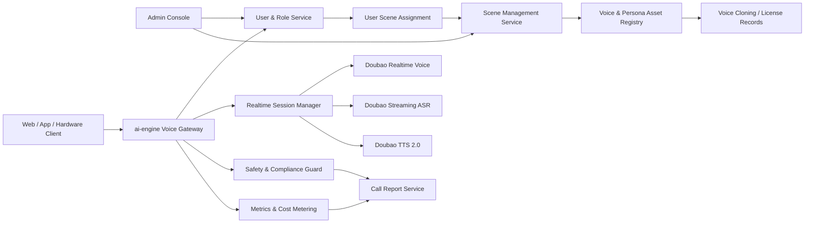

# 豆包语音陪伴类产品调研与落地设计

调研日期：2026-06-10

## 结论

建议不要把 `ai-engine` 的下一步产品做成“又一个 AI 恋爱/角色聊天 App”。国内 AI 陪伴软件在 2024 年快速增长，但 2025 年以后已经进入退热阶段：头部产品仍有用户规模，但普遍面临投放回落、留存变差、角色同质化、内容审核收紧和合规成本上升的问题。继续沿着“亲密关系 + 擦边剧情 + 抽卡养成”做 C 端产品，短期容易拉新，长期很难稳定。

更适合落地的方向是：

> 做一个基于豆包语音的“陪伴式语音 Agent 引擎”，先以 Web/App 场景体验台落地，再扩展成给家庭陪伴、学习陪练、适老陪伴、IP 角色、陪伴硬件使用的语音能力底座。

第一阶段产品不做心理治疗、不做医疗建议、不做未成年人恋爱情感陪伴、不做擦边角色；先做“可解释、可审计、可暂停、可转人工/家人”的日常陪伴。

## 现有工程基础

当前仓库已经具备做陪伴语音产品的雏形：

- 前端通过浏览器麦克风采集语音，转为 16k PCM 后发给本地 WebSocket。
- FastAPI 服务作为网关，连接火山引擎豆包端到端实时语音 WebSocket。
- 后端已接入 `wss://openspeech.bytedance.com/api/v3/realtime/dialogue`。
- 已实现 `StartConnection`、`StartSession`、`TaskRequest`、`SayHello`、`ChatTextQuery`、`FinishSession`。
- 已解析 ASR、TTS、Usage、错误事件。
- 前端已有 O2.0 默认语音、SC2.0 强人设、音色试听、文字输入、语速、响度、联网等调试能力。

这意味着短期不需要从零做语音链路。下一步的重点应该从“参数调试台”转向“陪伴场景产品”。

## 豆包语音 API/SDK 能力判断

### 1. 端到端实时语音大模型

豆包端到端实时语音大模型 API 是当前最适合做陪伴类产品主链路的能力。官方文档描述该 API 支持低延迟语音到语音对话，通过 WebSocket 连接；火山引擎的实时对话式 AI 方案也支持把 ASR、LLM、TTS 模块化方案替换为端到端实时语音大模型。

对陪伴产品的价值：

- 用户可以直接“开口说话”，不必经历 ASR 文本、LLM 文本、TTS 播放三个割裂步骤。
- 语音模型本身承担情绪、语气、节奏和停顿表达，比纯文本再转 TTS 更适合陪伴。
- 支持边上传音频边收听返回，适合电话式陪伴、虚拟角色、学习陪练。
- 现有 `ai-engine` 已经能作为服务端网关承接火山协议，避免前端暴露密钥。

需要进一步确认的点：

- 当前项目可用资源的 QPM、TPM、并发会话数和提额方式。
- O2.0、SC2.0、不同音色、声音复刻音色在实时语音链路上的可用范围。
- 错误码、断线重连、限流、资源不可用时的完整恢复策略。
- 是否可以通过 RTC SDK/实时对话式 AI 方案接入移动端、嵌入式设备和硬件场景。

### 2. 大模型流式语音识别 ASR

豆包语音有大模型流式语音识别 API，官方文档说明通过 WebSocket 协议实时访问 ASR 服务。

对陪伴产品的价值：

- 可用于通话转写、字幕、质检、敏感内容审计。
- 可在实时语音主链路之外作为旁路记录，不影响用户听感。
- 可为后续“通话报告”“家人摘要”“学习纠错”提供结构化材料。

建议用法：

- P0 不把独立 ASR 放进用户实时交互主链路，先复用端到端实时语音返回的 ASR 事件。
- P1 开始接独立 ASR，用于会后转写和质检，避免实时链路被复杂逻辑拖慢。

### 3. 豆包语音合成模型 2.0

豆包语音合成大模型面向文本转语音，火山引擎产品页强调上下文、情绪、语调和自然度。文档中也提到大模型语音合成 2.0 支持对话式合成范式。

对陪伴产品的价值：

- 非实时场景成本和体验更可控，例如睡前故事、日程播报、陪伴总结、学习材料朗读。
- 可以复用同一套音色资产，让用户感觉“同一个陪伴者”既能实时聊天，也能异步播报。
- 适合批量生成内容，不占用实时语音会话资源。

建议用法：

- P0 用端到端实时语音完成电话式体验。
- P1 接独立 TTS 做内容生成、提醒播报、陪伴总结音频。

### 4. 声音复刻 / 音色资产

火山引擎有声音复刻 API、声音复刻 2.0 最佳实践和音色管理能力。官方资料显示，声音复刻用于轻量级音色定制，相关能力可支持声音复刻大模型、豆包声音复刻模型 2.0、豆包端到端实时语音大模型。

对陪伴产品的价值：

- 家庭陪伴：可做被授权的家人音色，但必须非常谨慎。
- IP 陪伴：可做品牌、虚拟角色、主播、课程老师音色。
- 适老/儿童场景：声音熟悉度能提升接受度，但也最容易触发授权和误导风险。

必须做的产品约束：

- 所有克隆音色必须有授权记录、使用范围、过期时间和撤回机制。
- 家人音色默认不用于诱导消费、情感依赖、医疗或安全承诺。
- 用户界面必须明确提示当前为 AI 合成/AI 互动。
- 音色下线、授权撤回后，所有场景要自动不可选。

### 5. SDK 与接入形态

就当前工程而言，核心不是“找一个 SDK 替换现有代码”，而是把服务端 WebSocket 网关产品化。后续接 App、硬件、RTC 时再考虑火山实时对话式 AI、RTC SDK 或嵌入式接入方案。

推荐接入形态：

| 场景 | 推荐形态 | 理由 |
| --- | --- | --- |
| Web 原型 / 管理台 | 当前 FastAPI WebSocket 网关 | 已有代码，最快验证产品 |
| App 内实时通话 | 服务端网关 + App 音频采集，必要时接 RTC | 保持密钥和策略在服务端 |
| 陪伴硬件 / 桌面设备 | 设备采集 + 服务端网关，网络差时评估 RTC 方案 | 便于做长连接、唤醒和播放控制 |
| 内容播报 / 异步音频 | 独立 TTS API | 成本可控，不占实时会话 |
| 通话记录 / 质检 | 独立 ASR + 日志管线 | 可离线处理，不影响实时体验 |

## 国内陪伴类产品市场判断

### 市场阶段

国内 AI 陪伴产品已经经历了三个阶段：

1. 2023-2024：角色聊天和虚拟恋人快速增长，星野、猫箱、筑梦岛等产品出圈。
2. 2024 下半年-2025：商业化开始从订阅扩展到抽卡、写真、角色养成、剧情解锁等玩法。
3. 2025-2026：投放回落、留存走低、内容审核趋严、拟人化互动监管成型，市场开始分化。

重要判断：

- 用户确实需要“情绪价值”和“随时可说话的人”。
- 但纯角色聊天很容易同质化，用户新鲜感衰减快。
- 亲密关系和擦边剧情短期刺激付费，长期会带来合规、口碑和平台风险。
- 语音交互是下一阶段差异点，但只有语音不够，必须叠加场景任务、长期记忆和安全边界。

### 主要产品形态

| 类型 | 代表产品 | 核心玩法 | 商业模式 | 问题 |
| --- | --- | --- | --- | --- |
| 角色陪伴社区 | 星野、猫箱、筑梦岛 | 用户创建角色、聊天、语音、剧情、社区分发 | 订阅、增值、抽卡、装扮、剧情解锁 | 内容同质化、审核压力、留存衰减 |
| 虚拟恋人/情感伴侣 | 部分 AI 伴侣 App | 亲密关系、角色扮演、暧昧互动 | 订阅、时长、虚拟礼物 | 合规风险最高，不适合当前主线 |
| 学习陪练 | 口语陪练、考试陪练类产品 | 语音对话、纠错、打卡、学习计划 | 订阅、课程包 | 需要教学内容和评价体系 |
| IP/内容角色 | 网文、动漫、主播、品牌角色 | 和角色说话、剧情互动、粉丝运营 | IP 授权、会员、内容付费 | 内容供给和授权成本高 |
| 陪伴硬件 | 儿童/老人/家庭陪伴设备 | 语音通话、提醒、问答、安防、娱乐 | 硬件利润、会员、服务包 | 硬件周期长，交付链路重 |

### 用户需求拆解

陪伴产品不要只理解成“恋爱聊天”。真实需求可以拆成几类：

| 需求 | 用户表达 | 产品机会 | 风险 |
| --- | --- | --- | --- |
| 被倾听 | “我想找人说几句” | 低门槛语音倾诉、日常复盘 | 不能冒充心理咨询 |
| 被陪着做事 | “陪我学习/运动/睡前放松” | 任务型陪伴、节奏引导、打卡 | 避免制造压力或依赖 |
| 被提醒 | “别忘了吃药/喝水/复习” | 日程提醒、生活助手 | 不能替代医疗照护 |
| 被理解 | “它记得我说过的事” | 长期记忆、用户偏好、关系连续性 | 个人信息和敏感数据保护 |
| 被娱乐 | “角色有趣，会演” | IP 角色、剧情、小游戏 | 内容审核和未成年人保护 |
| 被守护 | “异常时能通知家人” | 风险识别、家人回传、紧急提示 | 不能承诺安全救援 |

### 竞争问题

当前陪伴 App 的共性问题：

- 文本角色差异小，多个角色越聊越像。
- 长对话记忆弱，用户很快感到“它不懂我”。
- 内容审核越严，角色越容易模板化。
- 用户和单个角色的关系生命周期短，平台必须不断供给新角色。
- 订阅价格低但模型成本高，靠投放买量容易 ROI 失衡。
- 未成年人、色情擦边、情感操纵、诱导消费容易触发监管。

这正是 `ai-engine` 不该直接复刻“角色社区”的原因。更可行的是做“语音陪伴能力 + 可信场景包”，先证明某几个高频场景的留存和成本模型。

## 合规与安全边界

截至 2026-06-10，国内陪伴类产品需要重点考虑：

- 《生成式人工智能服务管理暂行办法》已经自 2023-08-15 施行。
- 《互联网信息服务深度合成管理规定》要求深度合成服务在相关场景下提供或添加标识，并对算法备案、安全评估等提出要求。
- 《人工智能生成合成内容标识办法》已自 2025-09-01 施行，明确生成合成内容包括文本、图片、音频、视频、虚拟场景等，标识包括显式和隐式标识。
- 《人工智能拟人化互动服务管理暂行办法》已于 2026-04-10 公布，将自 2026-07-15 施行，直接覆盖情感互动、虚拟社交、角色扮演、适幼照护、适老陪伴等拟人化互动服务。

产品设计必须内置：

- AI 身份显式提示：每次进入会话、通话页、音频播放页都要明确“这是 AI”。
- 生成音频标识：TTS、声音复刻、通话录音导出要保留标识策略。
- 年龄分层：未成年人默认进入限制模式，禁用恋爱、擦边、成人角色和诱导消费。
- 时长管理：对连续陪伴时长、夜间使用、异常高频使用做提醒或冷却。
- 危机分流：识别自伤、他伤、严重心理危机时，不能继续角色扮演，要提示求助热线、家人、专业机构。
- 音色授权：克隆音色必须先授权后使用，可撤回、可追踪。
- 日志与申诉：保留必要日志用于安全审计，同时提供删除、导出、申诉机制。

## 推荐落地产品

### 产品名称

暂定：`伴声 Voice Companion Engine`

定位：

> 面向 App、Web、智能硬件和内容 IP 的陪伴式语音 Agent 引擎，提供实时语音对话、陪伴场景模板、角色/音色资产、长期记忆、通话报告和合规安全策略。

第一阶段不是独立大而全 C 端 App，而是“可直接演示、可试点、可嵌入客户产品”的语音陪伴体验台。

### 目标用户

第一批用户不选“泛情感恋爱陪伴”，而选三个更可控的场景：

| 场景 | 使用者 | 购买/决策者 | 价值 |
| --- | --- | --- | --- |
| 日常语音陪伴 | 独居青年、远程工作者、轻压力人群 | 用户本人 | 随时语音倾诉、日常复盘、陪伴做事 |
| 学习/口语陪练 | 学生、职场学习者 | 用户本人/家长/培训机构 | 可说话、可纠错、可打卡 |
| 适老日常陪伴 | 老年人 | 子女/家庭/社区/硬件厂商 | 问候、提醒、新闻闲聊、异常回传 |

不进入的场景：

- 未成年人恋爱情感陪伴。
- 成人擦边角色。
- 医疗诊断、心理治疗、金融法律建议。
- 伪装真人、伪装家人、伪装专业人士。

### 核心卖点

1. 低延迟自然语音：用户像打电话一样和 AI 说话。
2. 有边界的陪伴：不诱导依赖，不做医疗/心理承诺，异常时分流。
3. 场景化角色：不是无限自由角色池，而是可审核的场景模板。
4. 长期记忆可控：用户可以查看、编辑、删除 AI 记住的信息。
5. 音色资产可管理：官方音色、授权克隆音色、IP 音色统一管理。
6. 可嵌入：既能作为 Web 演示，也能接 App、硬件或客户业务。

## MVP 设计

### MVP 范围

MVP 只做 4 件事：

1. 语音通话：用户可以点击一个场景，直接和 AI 进行实时语音对话。
2. 场景模板：默认内置 3 个可分配场景，不开放用户自由创建成人角色。
3. 通话报告：每次通话结束后生成转写、摘要、情绪标签、风险标签、用量和延迟指标。
4. 合规保护：AI 身份提示、未成年人限制、敏感意图分流、通话时长提醒。

不做：

- 不做角色社区。
- 不做公开角色广场。
- 不做抽卡、写真、成人剧情。
- 不做完整 CRM、RAG 知识库、课程系统。
- 不做硬件量产，只预留硬件接入接口。

### MVP 场景模板

#### 1. 晚间复盘

用户目标：睡前说说今天发生了什么，被温和地整理情绪和明日计划。

交互流程：

1. AI 问候，提示“我不是心理咨询师，但可以陪你梳理今天”。
2. 用户讲述一天。
3. AI 用短句回应，不急着给建议。
4. AI 帮用户总结今天三件事：做得好的、困扰的、明天可以轻量尝试的。
5. 会话结束后生成“晚间小结”。

关键指标：

- 首包语音延迟。
- 单次会话完成率。
- 用户是否保存小结。
- 次日是否回访。

#### 2. 口语陪练

用户目标：用自然语音进行英语/中文表达练习。

交互流程：

1. 用户选择主题和难度。
2. AI 以陪练身份发起对话。
3. 对话中轻量纠错，不频繁打断。
4. 会后给出发音、表达、词汇建议。

关键指标：

- 用户开口时长。
- 有效轮次。
- 纠错接受率。
- 7 日打卡留存。

#### 3. 适老问候

用户目标：每天有一个稳定的语音伙伴问候、闲聊、提醒。

交互流程：

1. AI 以固定时间问候。
2. 聊天气、新闻、兴趣和家庭近况。
3. 轻量提醒喝水、用药、运动，但不替代医疗建议。
4. 检测异常表达时生成家人提醒草稿，由用户或授权家属配置是否接收。

关键指标：

- 每日接通率。
- 平均通话时长。
- 主动求助/异常提醒准确率。
- 家属查看摘要率。

## 产品功能设计

### 1. 账号角色与场景管理

场景功能需要独立处理，不能只作为前端写死的卡片。后台先管理场景资源，再把场景分配给不同用户或用户组；前台只展示当前用户可用的场景。

第一版只定义两个角色：

| 角色 | 权限 |
| --- | --- |
| 管理员 | 创建、编辑、上架、下架场景；体验场景效果；调整场景绑定的模型、音色、Prompt、开场白、安全策略、报告口径；把场景分配给用户或用户组；查看用量和质检结果。 |
| 用户 | 查看自己可用的场景；选择场景开始通话；查看自己的通话报告和长期记忆；不能修改场景底层配置。 |

场景作为独立资源管理：

| 字段 | 含义 |
| --- | --- |
| `id` | 场景 ID |
| `name` | 场景名称，例如晚间复盘、口语陪练、适老问候 |
| `description` | 给用户看的简短说明 |
| `status` | 草稿 / 已上架 / 已下架 |
| `model_mode` | O2.0 / SC2.0 / 后续其他模式 |
| `voice_asset_id` | 绑定的音色资产 |
| `system_prompt` | 场景系统提示词 |
| `opening_message` | 开场白 |
| `safety_policy_id` | 绑定的安全策略 |
| `report_schema_id` | 通话报告口径 |
| `created_by` | 创建管理员 |
| `updated_at` | 最近更新时间 |

用户与场景的关系单独管理：

| 表 | 作用 | 关键字段 |
| --- | --- | --- |
| `users` | 用户账号 | `id`、`name`、`role`、`status` |
| `scenes` | 场景配置 | `id`、`name`、`status`、`model_mode`、`voice_asset_id`、`safety_policy_id` |
| `user_scene_assignments` | 用户可用场景 | `user_id`、`scene_id`、`assigned_by`、`expires_at`、`status` |

默认用户创建规则：

- 管理员可以创建多个用户。
- P0 先按场景名称创建默认用户，例如“晚间复盘用户”“口语陪练用户”“适老问候用户”。
- 默认一个场景对应一个用户；每个默认用户只分配同名场景。
- 后续再支持一个用户绑定多个场景、用户组批量分配、客户级场景包。

通话开始时，服务端按 `user_id + scene_id` 校验用户是否有权限，再加载该场景的模型、音色、Prompt、安全策略和报告口径。前端不直接决定场景配置，只负责展示和发起选择。

### 2. 场景体验台

从当前“参数调试台”升级为“场景体验台”：

- 首页展示当前用户可用的场景卡片。
- 每个场景的模型模式、音色、系统提示词、开场白、审计策略、联网策略来自后台配置。
- 高级参数放到抽屉里，不让普通用户直接看到协议字段。
- 每个场景可一键开始语音通话。
- 通话中展示当前 ASR 文本、AI 关键句、通话时长、延迟状态。

### 3. 角色与音色资产

数据模型：

| 字段 | 含义 |
| --- | --- |
| `id` | 内部音色 ID |
| `provider` | `volcengine` |
| `provider_voice_type` | 豆包侧 voice/speaker ID |
| `display_name` | 用户看到的名称 |
| `voice_type` | 官方音色 / 克隆音色 / IP 音色 |
| `scene_scope` | 可用于哪些场景 |
| `license_status` | 未授权 / 已授权 / 过期 / 撤回 |
| `license_owner` | 授权主体 |
| `expires_at` | 授权过期时间 |
| `enabled_for_realtime` | 是否可用于实时语音 |
| `enabled_for_tts` | 是否可用于异步 TTS |
| `audit_level` | 审核等级 |

策略：

- 官方音色可以直接用于 P0。
- 克隆音色只在 P1 之后开放。
- 家人音色默认只允许私域使用，不进入公开模板。
- IP 音色必须绑定授权合同和可用话术范围。

### 4. 长期记忆

陪伴产品需要记忆，但不能黑盒记忆。

MVP 只做轻量记忆：

- 用户昵称。
- 常聊主题。
- 用户明确保存的偏好。
- 场景内目标，例如“每晚复盘”“每天练英语 10 分钟”。

不保存：

- 未经用户确认的敏感个人信息。
- 身份证、银行卡、精确住址。
- 医疗诊断、心理疾病标签。
- 未成年人隐私画像。

记忆界面：

- 用户可以看到“AI 记住了什么”。
- 用户可以删除单条记忆。
- 用户可以一键关闭长期记忆。

### 5. 通话报告

每次通话结束生成报告：

- 通话时间。
- 场景。
- ASR 转写。
- AI 摘要。
- 用户提到的待办。
- 情绪/风险标签。
- Token 用量。
- 音频首包延迟。
- 端到端响应延迟。
- 错误和中断记录。

报告用途：

- 用户自查。
- 学习场景做进步记录。
- 适老场景给授权家属查看摘要。
- 内部做质量评估和成本核算。

### 6. 安全策略

策略分层：

| 层级 | 处理 |
| --- | --- |
| 普通倾诉 | 正常陪伴，少建议，多倾听 |
| 低风险负面情绪 | 温和回应，建议休息、联系可信任的人 |
| 自伤/他伤/危机 | 停止角色扮演，提示联系家人、紧急服务、专业机构 |
| 成人/擦边引导 | 拒绝并转回安全话题 |
| 未成年人敏感话题 | 更严格拒绝，必要时提示监护人 |
| 医疗/法律/金融请求 | 不给专业结论，只建议咨询专业人士 |

## 系统架构

模块说明：

- `Voice Gateway`：统一客户端协议，屏蔽火山鉴权和二进制帧细节。
- `User & Role Service`：管理管理员和用户两个基础角色，控制后台配置权限和前台使用权限。
- `User Scene Assignment`：管理用户可见、可用的场景列表，通话开始前做 `user_id + scene_id` 权限校验。
- `Scene Management Service`：管理晚间复盘、口语陪练、适老问候等场景配置，支持草稿、上架、下架。
- `Realtime Session Manager`：管理会话开始、打断、结束、重连、超时。
- `Safety & Compliance Guard`：会前配置、会中拦截、会后审计。
- `Voice Asset Registry`：管理官方音色、克隆音色、IP 音色和授权。
- `Call Report Service`：汇总转写、摘要、风险、延迟和成本。
- `Metrics & Cost Metering`：按用户、场景、音色、模型统计用量。

## 研发路线

### P0：陪伴语音体验台

周期：2-4 周。

目标：把当前 Demo 改成能对外演示的陪伴产品原型。

范围：

- 先用内置配置提供 3 个默认场景：晚间复盘、口语陪练、适老问候。
- 增加最小账号角色：管理员和用户。
- 增加默认用户生成规则：按场景名创建默认用户，一个默认用户绑定一个同名场景。
- 管理员可以体验全部场景，并在体验台调整场景参数。
- 每个场景独立保存音色、开场白、system prompt、审计策略。
- 通话结束后显示基础报告：转写、摘要、用量、错误、延迟。
- 增加 AI 身份提示、时长提醒、未成年人模式入口。
- 指标埋点：连接耗时、首包延迟、ASR 完成耗时、TTS 队列积压、错误码。

验收：

- 每个场景可以连续完成 10 分钟真实语音对话。
- 默认用户只能进入与自己同名的场景。
- 管理员可以看到全部场景配置，并能在体验后调整场景参数；普通用户不能修改场景。
- 单用户 30 分钟连续通话不崩溃。
- 10 并发会话能记录错误和用量。
- 通话报告可用于人工质检。

### P1：长期记忆与音色资产

周期：4-8 周。

目标：让陪伴关系有连续性，同时把音色从参数变成资产。

范围：

- 用户可见、可删的长期记忆。
- 音色资产表和授权状态。
- 后台场景管理：创建、编辑、体验、调整、上架、下架、分配给用户。
- 官方音色与场景配置绑定。
- 独立 TTS 生成陪伴总结音频。
- 独立 ASR 生成更完整转写。
- 安全策略版本化。

验收：

- 用户能查看并删除记忆。
- 管理员能调整用户可用场景和场景参数，前台实时按权限展示。
- 未授权克隆音色不能被选择。
- 同一角色可同时用于实时通话和异步播报。
- 会后报告能区分场景、音色、模型和成本。

### P2：试点产品

周期：8-12 周。

目标：找一个真实客户或真实用户群试点。

优先试点：

1. 口语陪练小程序 / App 内嵌。
2. 适老陪伴平板 / 桌面设备。
3. IP 角色语音互动活动页。

范围：

- 完整账号体系。
- 订阅/试用额度。
- 家属/管理员授权。
- 场景包管理和用户/客户级场景分配。
- 客户级用量统计。
- 敏感内容复核后台。
- 运营配置后台。

验收：

- 有 100-500 名真实用户持续使用。
- 7 日留存、单次通话时长、成本可被稳定观测。
- 安全事件有可追溯日志。
- 试点场景能给出是否继续商业化的结论。

### P3：商业化版本

目标：从 Demo 和试点进入标准产品。

方向：

- B2B：给硬件厂商、教育机构、IP 方提供语音陪伴 SDK/API。
- B2B2C：和家庭陪伴硬件、社区养老、学习平台联合推出。
- C 端轻应用：保留少量高质量场景，不做开放角色广场。

商业模式：

- 按会话分钟数 / token / 并发计费。
- 场景包订阅。
- 音色资产管理费。
- 私有化或专属资源池交付费。
- IP 角色联合运营分成。

## 成功指标

### 产品指标

- 语音首包延迟 P50 / P95。
- 用户停止说话到 AI 开始说话的端到端延迟。
- 单次通话有效轮次。
- 单次通话完成率。
- 7 日留存。
- 用户主动复用同一场景的次数。
- 通话报告保存率。

### 商业指标

- 单分钟成本。
- 单次通话成本。
- 付费转化率。
- 订阅续费率。
- 试点客户转正式客户比例。
- 每客户月度毛利。

### 安全指标

- 敏感会话触发率。
- 高风险意图拦截率。
- 误拦截率。
- 未成年人模式覆盖率。
- 用户删除记忆/数据请求处理时长。
- 音色授权异常数。

## 与火山/豆包需要确认的问题

### 资源与计费

- 端到端实时语音大模型的 token 计费细则、最低资源包和超额价格。
- 实时语音、ASR、TTS、声音复刻能否统一计费和出账。
- POC 压测期间是否能申请临时 QPM/TPM/并发额度。
- 是否支持客户级资源隔离和专属资源池。

### 技术接口

- 实时语音完整错误码和重连建议。
- O2.0 / SC2.0 / 音色 / 复刻音色的可用组合。
- 端到端实时语音是否支持中途更新角色配置。
- 客户端上传 PCM、Opus、RTC 三种方式的推荐边界。
- App 和嵌入式硬件是否推荐使用 RTC SDK 接入。
- Usage 事件字段能否满足按场景、音色、客户计费。

### 合规和音色

- 声音复刻授权材料要求。
- 家人音色、未成年人音色、名人/IP 音色的限制。
- 克隆音色是否能用于端到端实时语音和独立 TTS。
- 音色下线、授权撤回、违规使用的回调或通知机制。
- 生成音频标识、水印、日志留存建议。

## 不建议做的事

- 不要把 P0 做成角色广场。
- 不要开放用户随意创建恋爱/成人角色。
- 不要把声音复刻作为普通输入框让用户随便填。
- 不要把心理咨询、医疗照护、紧急救援写成产品承诺。
- 不要为了短期留存使用擦边剧情和情感操纵话术。
- 不要在语音网关里写死 CRM、RAG、课程系统等业务逻辑。
- 不要同时深接多个语音供应商，先把豆包主链路跑稳。

## 下一步执行建议

1. 保留现有实时语音代码，新增“场景模板”配置层。
2. 新增最小账号角色：管理员、用户。
3. 把场景做成独立配置资源，先支持默认场景的体验、调整、上架、下架和用户分配。
4. 将首页从参数调试改成“当前用户可用场景”入口。
5. 按场景名创建默认用户，一个默认用户只绑定一个同名场景。
6. 普通用户只暴露开始通话、结束通话、文字补充输入、报告查看。
7. 管理员额外保留场景体验、音色试听、Prompt/开场白/高级参数调整入口。
8. 增加通话指标埋点和会后报告。
9. 增加最小合规提示：AI 身份、非专业服务、年龄/时长提示。
10. 用 20-30 个真实用户做 1 周试用，比较不同用户、不同场景的留存和成本。
11. 根据数据决定第一条商业化路线：口语陪练、适老陪伴或 IP 角色。

## 参考资料

- 火山引擎：豆包端到端实时语音大模型 API 接入文档：https://www.volcengine.com/docs/6561/1594356
- 火山引擎：接入端到端实时语音大模型：https://www.volcengine.com/docs/6348/1902994
- 火山引擎：豆包语音模型列表：https://www.volcengine.com/docs/6561/2499930
- 火山引擎：大模型流式语音识别 API：https://www.volcengine.com/docs/6561/1354869
- 火山引擎：豆包语音合成大模型：https://www.volcengine.com/product/tts
- 火山引擎：声音复刻 API V3：https://www.volcengine.com/docs/6561/2227958
- 火山引擎：声音复刻下单及使用指南：https://www.volcengine.com/docs/6561/1167802
- 火山引擎：豆包端到端实时语音计费说明：https://www.volcengine.com/docs/6561/1359370
- 每日经济新闻：从星野、猫箱爆火到百度、京东入场，AI 社交热背后：https://www.nbd.com.cn/articles/2025-07-04/3933446.html
- 21 财经：AI 陪伴“擦边”争议背后行业陷入商业迷茫：https://www.21jingji.com/article/20250621/herald/d73c6fb3e1729aadd896b8c53dbccb28.html
- 虎嗅：下载量暴跌八成，AI 社交涨不动了：https://m.huxiu.com/article/4532115.html
- 南方财经：AI 伴侣大逃杀，星野下架大量智能体：https://www.sfccn.com/2025/11-29/0NMDE1MjJfMjA4NDE0NA.html
- 36 氪：一年时间被拉下神坛，社交 AI 还有生存空间吗：https://m.36kr.com/p/3280404239836681
- App Store：星野产品页：https://apps.apple.com/cn/app/%E6%98%9F%E9%87%8E-%E6%89%80%E5%BB%BA%E7%9A%86%E4%BD%A0%E6%89%80ai/id6463076337
- 中央网信办：生成式人工智能服务管理暂行办法：https://www.cac.gov.cn/2023-07/13/c_1690898327029107.htm
- 中央网信办：互联网信息服务深度合成管理规定：https://www.cac.gov.cn/2022-12/11/c_1672221949354811.htm
- 中央网信办：人工智能生成合成内容标识办法：https://www.cac.gov.cn/2025-03/14/c_1743654684782215.htm
- 中央网信办：人工智能拟人化互动服务管理暂行办法：https://www.cac.gov.cn/2026-04/10/c_1777558395078289.htm
- 中央网信办：《人工智能拟人化互动服务管理暂行办法》答记者问：https://www.cac.gov.cn/2026-04/10/c_1777558395284407.htm
