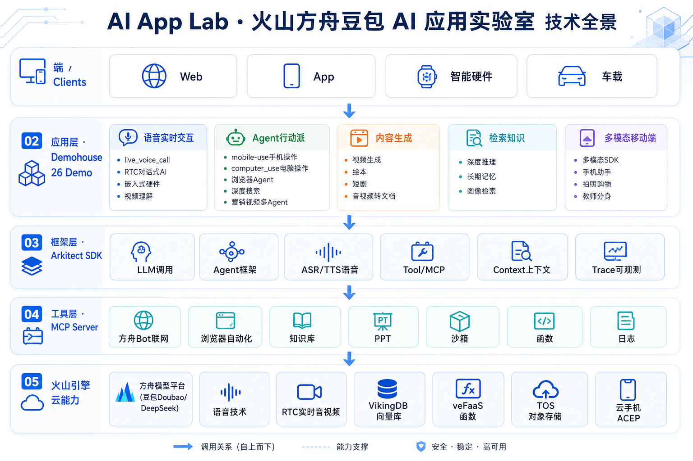
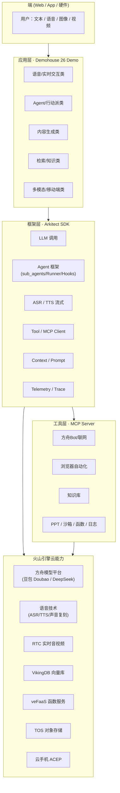
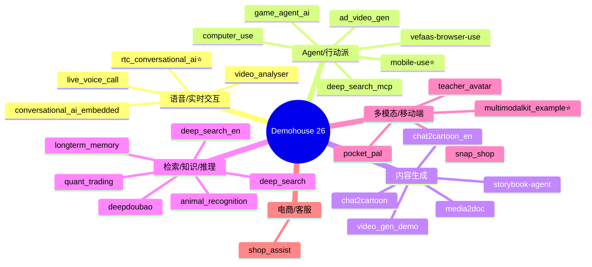
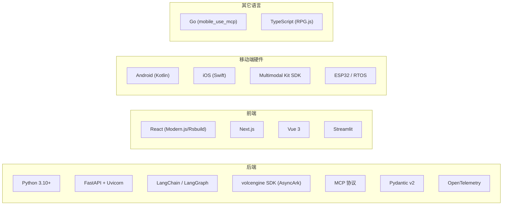
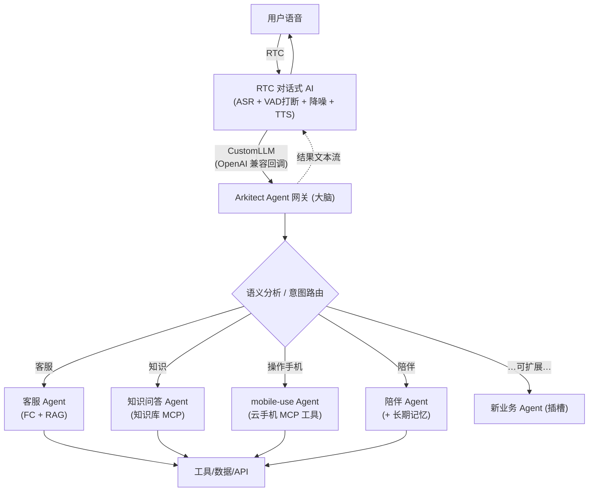

# AI App Lab 技术地图 / 项目全景手册

> 火山引擎·火山方舟（豆包大模型）官方 AI 应用实验室（[volcengine/ai-app-lab](https://github.com/volcengine/ai-app-lab)）的全量技术梳理。
> 用途：项目速查、选型参考、二次开发起点。本文为内部整理文档，可随时增删。



---

## 目录

1. [一句话定位](#一句话定位)
2. [整体架构](#整体架构)
3. [支柱一：Arkitect SDK](#支柱一arkitect-sdk)
4. [支柱二：Demohouse（26 个原型应用）](#支柱二demohouse26-个原型应用)
5. [MCP Server 集合](#mcp-server-集合)
6. [Examples（SDK 入门示例）](#examplessdk-入门示例)
7. [技术栈总览](#技术栈总览)
8. [实时语音三种方案对比](#实时语音三种方案对比)
9. [推荐落地架构：语音入口 + Agent 路由](#推荐落地架构语音入口--agent-路由)
10. [商机 / 落地方向](#商机--落地方向)
11. [快速上手与凭证清单](#快速上手与凭证清单)

---

## 一句话定位

**把豆包大模型落地成可运行场景应用的"积木库"。** 它解决模型调用、插件协同、多模态（文本/图像/语音）融合、工具调用、Agent 编排等工程问题，让开发者复制原型 + 叠加行业 Know-How 即可成型。

- `arkitect/` — 官方高代码 Python SDK（可 `pip install arkitect`）
- `demohouse/` — 26 个垂直场景原型，可"一键复制"再定制
- `mcp/server/` — 7 个官方 MCP 工具服务
- `examples/` — SDK 入门示例
- 许可证：`arkitect/` 为 Apache 2.0；`demohouse/` 为【火山方舟】原型应用自用许可

---

## 整体架构



---

## 支柱一：Arkitect SDK

路径：`arkitect/`，包名 `arkitect`（见 `pyproject.toml`）。面向企业开发者的高代码 SDK。

### 核心组件（`arkitect/core/component/`）

| 组件目录 | 作用 | 关键类/能力 |
|---|---|---|
| `llm/` | 大模型调用封装 | `BaseChatLanguageModel`，流式 `astream()` |
| `agent/` | Agent 框架 | `BaseAgent`、`DefaultAgent`，支持 `tools` / `sub_agents` / `instruction` / `SwitchAgent` |
| `runner/` | Agent 执行器 | `Runner`，含 checkpoint 恢复 |
| `llm_event_stream/` | 事件流 + Hook | Pre/Post 的 LLM/Tool/Agent Hook |
| `tool/` | 工具/MCP | `MCPClient`、工具池、内置工具（如 `link_reader`） |
| `context/` | 上下文 | Prompt 渲染、工具注册、对话上下文 |
| `prompts/` | 提示词模板 | 模板渲染 |
| `asr/` | 流式语音识别 | `AsyncASRClient`、`ASRFullServerResponse` |
| `tts/` | 流式语音合成 | `AsyncTTSClient`、`AudioParams`、`ConnectionParams` |
| `bot/` | Bot 封装 | 方舟 Bot 相关 |
| `checkpoint/` | 会话检查点 | Redis 等持久化 |
| `output_parser/` | 输出解析 | 结构化输出 |

### 其它模块

- `arkitect/launcher/local/` — `launch_serve()` 本地 FastAPI 启动
- `arkitect/launcher/vefaas/` — 火山函数服务部署封装
- `arkitect/telemetry/` — OpenTelemetry Trace、日志
- `arkitect/types/` — 请求/响应/事件类型定义

### Agent 框架要点

`BaseAgent` 原生支持三类扩展，是"多 Agent 路由"的基础：

```python
class BaseAgent(abc.ABC, BaseModel):
    name: str
    model: str
    tools: list[Union[MCPClient | Callable]] = []   # 挂工具
    sub_agents: list["BaseAgent"] = []               # 挂子 Agent（路由分发）
    instruction: str | None = None                   # 角色/任务指令
    pre_agent_call_hook / post_agent_call_hook        # 可插拔 Hook
```

---

## 支柱二：Demohouse（26 个原型应用）

按场景分类。⭐ = 与"语音入口 + Agent 路由"目标最相关；⚠️ = 依赖内部实现，开源工程暂无法整体编译。



### A. 语音 / 实时交互类

| Demo | 简介 | 技术要点 | 可运行 |
|---|---|---|---|
| `live_voice_call` | 实时语音通话"乔青青" | WebSocket 级联 ASR→LLM→TTS（半双工，不可打断） | ✅（效果一般，仅 demo 级） |
| `rtc_conversational_ai` ⭐ | 超低延迟实时对话 | RTC+ASR+LLM+TTS，全双工/VAD打断/降噪/~1s延迟；支持 **CustomLLM** | 仅文档，源码在外部 [rtc-aigc-demo](https://github.com/volcengine/rtc-aigc-demo) |
| `conversational_ai_embedded` | 嵌入式硬件实时对话 | ESP32 等，RTOS HAL，内存<300KB，声音复刻 | 仅文档，源码在外部 [rtc-aigc-embedded-demo](https://github.com/volcengine/rtc-aigc-embedded-demo) |
| `video_analyser` | 视频实时理解+语音问答 | 前端 ASR(WebSocket)+TTS+视觉 | ✅ |

### B. Agent / 行动派类

| Demo | 简介 | 技术要点 | 可运行 |
|---|---|---|---|
| `mobile-use` ⭐ | 自然语言自动操作手机 | 云手机 + 豆包视觉 + **LangGraph ReAct**；操作以 **MCP 工具**暴露 | ✅（需云手机凭证，MCP 仅 Linux 构建） |
| `computer_use` | 桌面自动操作 | Doubao UI-TARS，planner + tool_server + mcp_server | ✅（多服务） |
| `vefaas-browser-use` | 浏览器自动化 Agent | Playwright + 多 LLM（含 ARK） | ✅ |
| `deep_search_mcp` | 深度搜索+多 MCP | **Supervisor→Worker** 多 Agent 编排，supervisord 管理多 MCP | ✅（最复杂 Agent Demo） |
| `ad_video_gen` | 电商营销视频生成 | A2A 四 Agent（市场/导演/评估/发布），VeADK 框架 | ✅ |
| `game_agent_ai` | AI 生成 RPG 游戏 | 对话 + Thinking 模型 + RPG.js + Streamlit | ✅ |

### C. 内容生成类

| Demo | 简介 | 技术要点 | 可运行 |
|---|---|---|---|
| `chat2cartoon` / `_en` | 互动双语视频生成 | 多阶段生成 + WatchAndChat 语音互动 | ✅ |
| `storybook-agent` | AI 故事书/连环画 | Seed 1.6 + Seedream 4.0 | ✅ |
| `video_gen_demo` | 互动故事短剧 | Streamlit，轻量 | ✅ |
| `media2doc` | 音视频转文档 | ASR + 文档生成，Vue3 + Docker | ✅（`docker-compose`） |

### D. 检索 / 知识 / 推理类

| Demo | 简介 | 技术要点 | 可运行 |
|---|---|---|---|
| `deep_search` / `_en` | 深度推理+联网搜索 | 推理链路 | ✅ |
| `deepdoubao` | DeepSeek-R1 推理+豆包总结 | 双模型协同 | ✅ |
| `longterm_memory` | 长期记忆 | mem0 + VikingDB 向量库 | ✅ |
| `animal_recognition` | 动物图片检索+介绍 | VikingDB + TOS + VLM | ✅ |
| `quant_trading` | 股票 AI 辅助预测 | 量化分析 | ✅（Windows 安装待补） |

### E. 多模态 / 移动端类

| Demo | 简介 | 技术要点 | 可运行 |
|---|---|---|---|
| `multimodalkit_example` ⭐ | 多模态 SDK 示例 | Android/iOS/Web 三端；ASR/TTS/端侧图像分割/物体识别/实时通话 | ✅（各端 README） |
| `pocket_pal` | 手机助手"所见即所说" | 悬浮球 + 截屏 + 豆包 Seed-1.6 视觉 + 语音 | ⚠️（仅开源 Web 前端） |
| `teacher_avatar` | 教师分身 | 拍照解题 + 语音讲解（基于多模态 SDK） | ✅（含 Android） |
| `snap_shop` | 拍照购物 | 相机识物 + ASR/TTS | ⚠️ |

### F. 电商 / 客服类

| Demo | 简介 | 技术要点 | 可运行 |
|---|---|---|---|
| `shop_assist` | 智能电商客服 | Function Calling + RAG | ✅ |

---

## MCP Server 集合

路径：`mcp/server/`，作为 Agent 的工具生态。

| Server | 能力 |
|---|---|
| `mcp_server_ark` | 方舟 Bot 聊天、联网搜索、链接解析、计算器 |
| `mcp_server_vefaas_browser_use` | 浏览器自动化任务 |
| `mcp_server_knowledgebase` | 知识库检索 |
| `mcp_server_ppt` | ChatPPT 生成 |
| `mcp_server_vefaas_function` | veFaaS 函数调用 |
| `mcp_server_vefaas_sandbox` | 沙箱代码执行 |
| `mcp_server_tls` | 日志服务 |

> 注：手机操作的 `mcp_server_mobile_use` 在独立仓库 [volcengine/mcp-server](https://github.com/volcengine/mcp-server)。

---

## Examples（SDK 入门示例）

| 示例 | 内容 |
|---|---|
| `examples/agent_framework/` | DefaultAgent + Tools + Runner + 6 种 Hook；`main.py` 已是 OpenAI 兼容服务骨架 |
| `examples/human_in_the_loop/` | 人机协同：Hook 中断等待人工确认 |
| `examples/quick_start/` | Cookbook（`arkitect_cookbook.ipynb` + Python 脚本） |

---

## 技术栈总览



- **依赖管理**：uv / Poetry（后端）、pnpm / npm（前端）
- **部署**：本地 `launch_serve`、veFaaS 函数服务、Docker（media2doc）

---

## 实时语音三种方案对比

| 维度 | live_voice_call | RTC 对话式 AI（CustomLLM）⭐ | 端到端 S2S 大模型 |
|---|---|---|---|
| 链路 | 级联 ASR→LLM→TTS | RTC + ASR + 自定义LLM + TTS | 语音直接进/出（Speech2Speech） |
| 模式 | 半双工，不可打断 | 全双工，VAD 帧级打断 | 全双工，随时打断 |
| 延迟 | 高（多段叠加） | ~1 秒 | 最低 |
| 拟人/情感 | 一般（丢语气） | 较好 | 最佳（情感承接强） |
| **自定义大脑/多 Agent 路由** | 可改但要自己拼 | ✅ **CustomLLM 回调你的 Agent 网关** | 较弱（黑盒，靠 function calling） |
| 多端 | Web | iOS/Android/Web/桌面/小程序等 | 依接入方案 |
| 适用 | 学习参考 | **业务型语音 Agent（强烈推荐）** | 极致拟人陪伴/助手 |
| 版本 | — | — | S2S-Omni（助手）/ S2S-SC（人格陪伴） |

**结论**：要做"语音入口 + 语义路由 + 多 Agent 业务"，首选 **RTC 对话式 AI + CustomLLM**：语音体验白嫖平台工业级方案，大脑用 Arkitect 自己掌控、可无限扩展。

---

## 推荐落地架构：语音入口 + Agent 路由



落地路径：
1. RTC 控制台**无代码跑通**对话式 AI，验证体验。
2. 切 **CustomLLM** 模式，回调最简后端。
3. 用 **Arkitect**（`examples/agent_framework/main.py` 改造）实现网关：意图路由 + 2~3 个业务 Agent。
4. 需要操作手机的任务，把 `mobile-use` 作为工具/子 Agent 挂上。

---

## 商机 / 落地方向

| 方向 | 组合积木 | 价值/付费点 |
|---|---|---|
| 行业语音客服/坐席（最易变现） | RTC + shop_assist + 知识库 | 替代/辅助人工，按坐席或调用量 |
| 拟人陪伴/情感助手 | S2S-SC 或 RTC + longterm_memory | 订阅制（陪伴/关怀/教育） |
| 语音控制行动派 Agent（差异化最强） | 语音入口 + mobile-use / computer_use | 无障碍助手、银发数字助手、RPA 语音化 |
| 垂直语音助理 | teacher_avatar / snap_shop / 车载硬件 | 教育、导购、IoT |
| 企业知识语音问答台 | RTC + mcp_server_knowledgebase | 内训、合规、IT helpdesk |

---

## 快速上手与凭证清单

**通用凭证**（多数 Demo 需要）：
- 火山方舟 API Key（`ARK_API_KEY`）
- 方舟模型 Endpoint ID（创建豆包模型推理接入点）
- 火山引擎 AK / SK（部分服务）

**按能力追加**：
- 语音：开通语音技术产品，拿 ASR/TTS 的 AppID + Access Token
- RTC 实时语音：RTC 应用 AppID/AppKey + 开通对话式 AI
- 云手机（mobile-use）：ACEP AK/SK/AccountID + TOS 对象存储
- 向量检索（longterm_memory/animal_recognition）：VikingDB
- 函数部署：veFaaS

**典型启动**：后端 `uv`/`poetry` 装依赖后跑 `run.sh` 或 `python -m handler`；前端 `pnpm install && pnpm dev`。具体见各 Demo 自带 README。

---

*文档生成参考：仓库根 `README.md`、`arkitect/`、`demohouse/*/README.md`、各 Demo 源码。如项目更新，请同步维护本表。*
